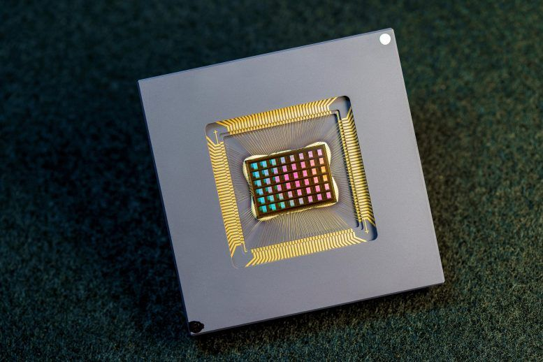

## New AI-Powered App Could Boost Smartphone Battery Life by 30% [^1]

EOptomizer App is a new cutting-edge AI invention spearheaded by Dr. Amit Singh, the University of Essex. The app could potentially increase smartphone battery life by upto 30% thus saving electricity and bills. The app uses AI to optimize performance, heat generation, and efficiency of the chip.

The app is conceived to be used throughout the industry and help reduce carbon emissions.

## Highly-Efficient New Neuromorphic Chip for AI on the Edge [^2]

The NeuRRAM chip is the first compute-in-memory chip to demonstrate a wide range of AI applications while using just a small percentage of the energy consumed by other platforms while maintaining equivalent accuracy.

Intel has unveiled a chip that can run a wide variety of AI applications at a fraction of the energy consumed by other platforms. NeuRRAM chip can perform sophisticated cognitive tasks anywhere and anytime without relying on a network connection to a central server. It is twice as energy efficient as the state-of-the-art "compute-in-memory" chips.

## Van Gogh’s ‘hidden’ portrait recreated 135 years after being painted [^3]

Portrait of two male wrestlers was discovered 10 years ago beneath another Van Gogh painting. It shows the two men locked in combat with splashes of red blood against a background of blue strokes. X-ray technology had previously revealed the painting, but artificial intelligence has now brought it to life in colour.

")

This painting was thought to have been lost or destroyed until it was rediscovered behind another Van Gogh work in 2012.

## Digitizing Smell: Using Molecular Maps to Understand Odor [^4]

>Did you ever try to measure a smell? …Until you can measure their likenesses and differences you can have no science of odor. If you are ambitious to found a new science, measure a smell.
>
— Alexander Graham Bell, 1914.

&nbsp;

Smells are produced by molecules that waft through the air and enter our noses, and bind to sensory receptors. Potentially billions of molecules can produce a smell, so figuring out which ones produce which smells is difficult to catalog or predict. Sensory maps can help us solve this problem, and have existed for centuries, but not for smell.
The model works by exploring thousands of examples of distinct molecules paired with the smell labels that they evoke, e.g., "beefy", "floral", or "minty".

 in which coordinates can be directly translated into values for hue and saturation. Similar colors lie near each other, and specific wavelengths of light (and combinations thereof) can be identified with positions on the map. Right: Odors in the Principal Odor Map operate similarly. Individual molecules correspond to points (grey), and the locations of these points reflect predictions of their odor character.")

[^1]:  [https://scitechdaily.com/new-ai-powered-app-could-boost-smartphone-battery-life-by-30/](https://scitechdaily.com/new-ai-powered-app-could-boost-smartphone-battery-life-by-30/)
[^2]:  [https://scitechdaily.com/highly-efficient-new-neuromorphic-chip-for-ai-on-the-edge/](https://scitechdaily.com/highly-efficient-new-neuromorphic-chip-for-ai-on-the-edge/)
[^3]:  [https://www.independent.co.uk/arts-entertainment/art/van-gogh-hidden-painting-wrestlers-b2155439.html](https://www.independent.co.uk/arts-entertainment/art/van-gogh-hidden-painting-wrestlers-b2155439.html)
[^4]:  [https://ai.googleblog.com/2022/09/digitizing-smell-using-molecular-maps.html](https://ai.googleblog.com/2022/09/digitizing-smell-using-molecular-maps.html)