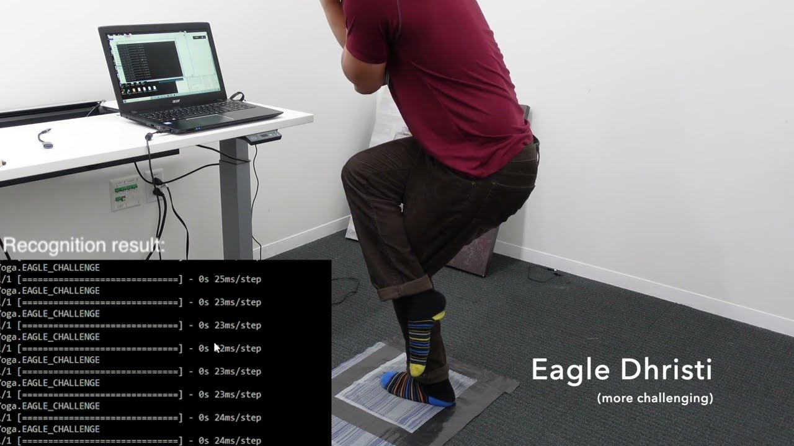
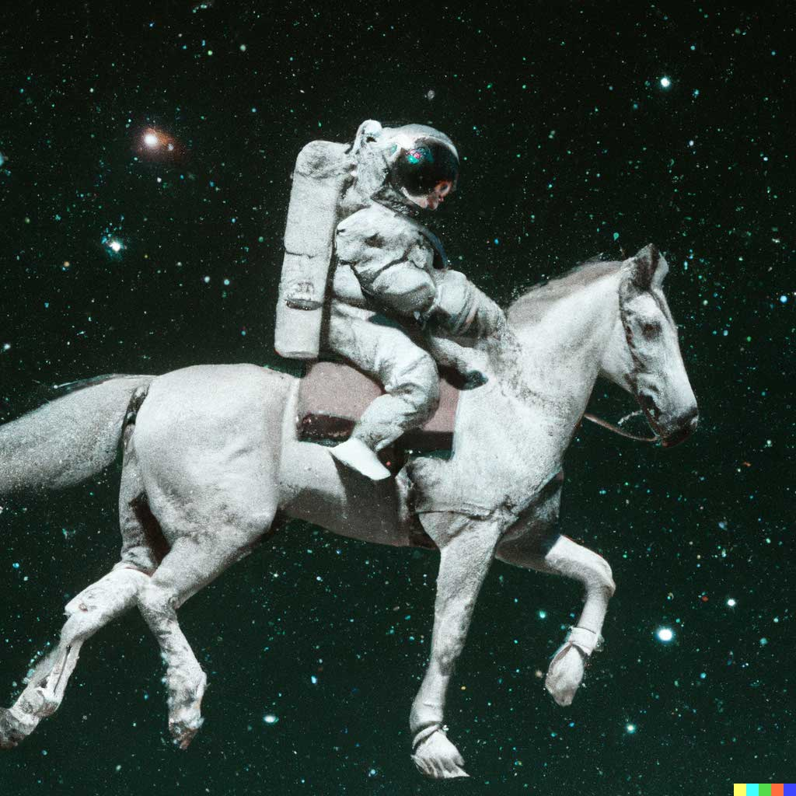

In this world of fast-paced progress, everyday we try to find out new updates, new features and new inventions that are shaping our future life like never before. Day by day, the information surrounding us increases, bombarding us with bits only to be forgotten or missed leaving us completely overwhelmed in the process .

By collecting & organizing the data, we have built tools to build models and generate AI that have started to pop in the real world. Lots of people consider AI as an evolutionary change in human life, which is quite debatable. But collecting knowledge about all the new changes is still possible for us.

Thus, The Month in AI Blog Series aims to summarize newest trends & research breakthroughs that will shape the world of AI.

## The Meta AI : Greater creative control for AI image generation [^1]

Meta AI published the AI research concept known as Make-A-Scene. Make-A-Scene had the potential to empower the imagination into a life.

It can be hard to generate compositions of two different parts. If we consider the example ‘cat hanging to the tree’. This type of prediction may be hard for the model. The height of the tree is smaller than a cat or bigger than a cat, Is the cat hanging to the left side or right side, Is it facing upside or downside. So reflection of image won't be the solution of this perdition.

To overcome this problem the scientist starts working on the sketch part so if a non-artist draws anything he can get the output that they are imagining.

## Smart textiles sense how their users are moving [^2]

07 July, 2022 MIT Researchers developed a comfortable, form-fitting fabric that recognizes its wearer’s activities, like walking, running, and jumping.

   

Using a novel fabrication process, MIT researchers have produced smart textiles that snugly conform to the body so they can sense the wearer’s posture and motions.

The technique could have many applications, especially in health care and rehabilitation. For example, it could be used to produce smart shoes that track the gait of someone who is learning to walk again after an injury, or socks that monitor pressure on a diabetic patient’s foot to prevent the formation of ulcers.

## ML-Enhanced Code Completion Improves Developer Productivity [^3]

Today we describe how we combined ML and SE to develop a novel Transformer-based hybrid semantic ML code completion, now available to internal Google developers.

The increasing complexity of code poses a key challenge to productivity in software engineering. Code completion has been an essential tool that has helped mitigate this complexity in integrated development environments (IDEs).

A common approach to code completion is to train transformer models, which use a self-attention mechanism for language understanding, to enable code understanding and completion predictions. We treat code similar to language, represented with sub-word tokens and a SentencePiece vocabulary, and use encoder-decoder transformer models running on TPUs to make completion predictions. The input is the code that is surrounding the cursor (~1000-2000 tokens) and the output is a set of suggestions to complete the current or multiple lines. Sequences are generated with a beam sea rch (or tree exploration) on the decoder.

## DALL E 2 - OpenAI [^4]

The artificial intelligence research lab OpenAI revealed DALL-E 2, the successor to 2021’s DALL-E. Both AI systems can generate astounding images from natural-language text descriptions.

DALL·E is a 12-billion parameter version of GPT-3 trained to generate images from text descriptions, using a dataset of text–image pairs. We’ve found that it has a diverse set of capabilities, including creating anthropomorphized versions of animals and objects, combining unrelated concepts in plausible ways, rendering text, and applying transformations to existing images.

[^1]:  [https://ai.facebook.com/blog/greater-creative-control-for-ai-image-generation/](https://ai.facebook.com/blog/greater-creative-control-for-ai-image-generation/)
[^2]:  [https://news.mit.edu/2022/smart-textiles-sense-movement-0707](https://news.mit.edu/2022/smart-textiles-sense-movement-0707)
[^3]:  [https://ai.googleblog.com/2022/07/ml-enhanced-code-completion-improves.html](https://ai.googleblog.com/2022/07/ml-enhanced-code-completion-improves.html)
[^4]:  [https://openai.com/dall-e-2/](https://openai.com/dall-e-2/)