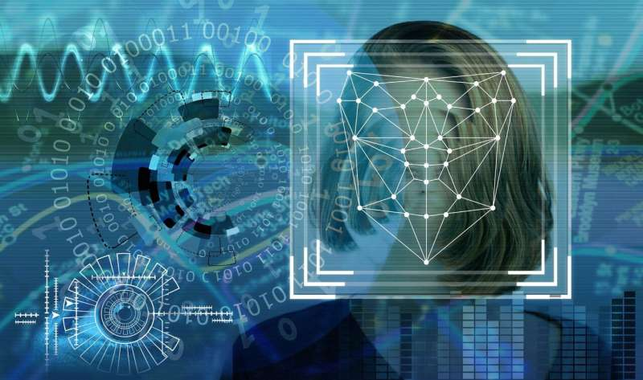
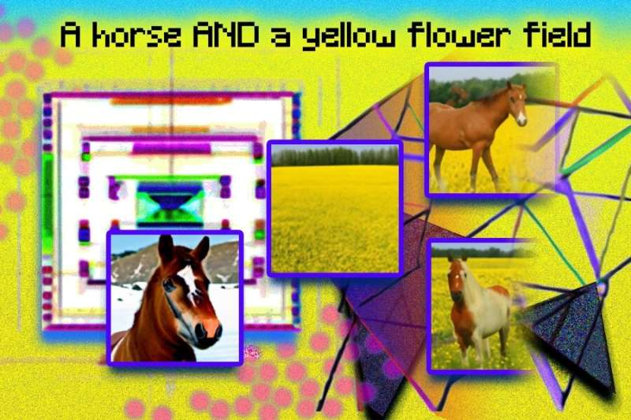

## An AI that can help to design new proteins and to unlock new cures and materials [^1]

An AI that can help to design new proteins and to unlock new cures and materials.An AI that can help to design new proteins and to unleash new cures and accoutrements.Artificial intelligence could help unleash the development of more effective vaccines, speed up exploration for the cure to cancer, or lead to fully new accoutrements.

A new AI tool could help experimenters discover preliminarily unknown proteins and design entirely new bones. AI tool nascence Fold that used deep literacy to break one of the “grand challenges “of biology by directly prognosticating the shapes of proteins.

A group of experimenters from the University of Washington described a new tool ProteinMPNN, which offers an important complement to that technology. ProteinMPNN will open an entire new macrocosm of possible proteins for experimenters to design from scrape.

ProteinMPNN will help experimenters with the inverse problem. The system uses a neural network trained on exemplifications of amino acid sequences, which fold into three- dimensional structures.

Machine literacy will make the whole process a lot hastily and lightly, and will allow experimenters to produce fully new proteins and structures on a much larger scale. The software is further than 200 times faster than the former stylish tool and requires minimum stoner input, potentially lowering the walls to entry for protein design.

## An Open Source Unified Language Learner [^2]

In Unifying Language Learning Paradigms, google researchers presented a novel language pre-training paradigm called Unified Language Learner (UL2) that improves the performance of language models universally across datasets and setups.

Building models that understand and generate natural language well is one of the grand goals of machine learning (ML) research. Improving the quality of language models is a key target for researchers to make progress toward such a goal. ML can have a direct impact on building smart systems for everyday applications.

UL2 frames different objective functions for training language models as demising tasks, where the model has to recover missing sub-sequences of a given input. During pre-training it uses a novel mixture-of-denoisers that samples from a varied set of such objectives, each with different configurations. Google researchers demonstrate that models trained using the UL2 framework perform well in a variety of language domains, including prompt-based few-shot learning and models fine-tuned for downstream tasks.

UL2 is trained using a mixture of three denoising tasks:
1. R-denoising (or regular span corruption), which emulates the standard T5 span corruption objective.
2. X-denoising (or extreme span corruption
3. S-denoising (or sequential Prefix LM). During pre-training, we sample from the available denoising tasks based on user-specified ratios (i.e.different combinations of the R, X, and S-denoisers) and prepare the input and target appropriately. Then, a paradigm token is appended to the input (one of [R], [X], or [S]) indicating the denoising task at hand.

## AI can detect drunkenness by evaluating infrared images of human faces with 93% accuracy [^3]

A new study from the University of California, Irvine, has found that AI can detect drunkenness by evaluating infrared images of human faces with 93% accuracy. The study, published in the journal Scientific Reports, is the first to use infrared images to detect drunkenness.

With the help of convolutional neural networks an AI can now predict whether the person is drunk or not. With the accuracy of 93% using thermal infrared images of human faces. 

The earlier efforts at developing a way to detect drunkenness have focused on eye state, head position, or functional state indicators. However, such systems might be confused by other factors.

It is important that any system designed to identify inebriated people must have a very low rate of false positives and false negatives. After all, a false negative might see a drunk person driving their car whereas too many false positives would preclude sober drivers from using their vehicles and lead to frustration and a loss of trust in the system among the public.

But optimizing the classification through larger training datasets on a diverse population of thermal images should bring it closer to the ideal, which would, of course, be the theoretically unachievable 100% accuracy with zero false positives, and zero false negatives.

## An open-source image database that unlocks the power of AI for ocean exploration [^4]

As scientists and engineers develop advanced robotics that can visualize marine life and environments to monitor changes in the ocean's health, they face a fundamental problem: The collection of images, video, and other visual data vastly exceeds researchers' capacity for analysis.

Fathom Net is an open-source image database that uses state-of-the-art data processing algorithms to help process the backlog of visual data. Using artificial intelligence and machine learning will alleviate the bottleneck for analyzing underwater imagery and accelerate important research around ocean health.

Recent advances in machine learning enable fast, sophisticated analysis of visual data, but the use of artificial intelligence in ocean research has been limited by the lack of a standard set of existing images that could be used to train the machines to recognize and catalog underwater objects and life. Fathom Net addresses this need by aggregating images from multiple sources to create a publicly available, expertly curated underwater image training database.

Fathom Net is a collection of 1.5 million images of marine life and ocean environments, including 1 million images of fish and 500,000 images of coral. The database is designed to be used by researchers and engineers to train machine learning models to recognize and catalog underwater objects and life.

## How AI image generators could help robots learn to see [^5]

Researchers have developed a new AI system that can generate images of objects that a robot has never seen before. The system could help robots learn to see, and could also be used to create realistic images for training AI systems. 

The researchers recently developed a new method that makes models like DALL-E 2 more creative and have better scene understanding. Here, they describe how these models work, whether this technical infrastructure can be applied to other domains, and how we draw the line between AI and human creativity.

AI image generators, which create fantastical sights at the intersection of dreams and reality, bubble up on every corner of the web. Their entertainment value is demonstrated by an ever-expanding treasure trove of whimsical and random images serving as indirect portals to the brains of human designers. A simple text prompt yields a nearly instantaneous image, satisfying our primitive brains, which are hardwired for instant gratification.

Although seemingly nascent, the field of AI-generated art can be traced back as far as the 1960s with early attempts using symbolic rule-based approaches to make technical images. In the 1990s, the field of generative art emerged, which used stochastic processes to generate images. In the 2000s, the field of generative adversarial networks (GANs) emerged, which used deep learning to generate images. The field of AI-generated art has since exploded, with many different approaches to generating images.

[^1]: [https://www.technologyreview.com/2022/09/15/1059550/an-ai-that-can-design-new-proteins-could-help-unlock-new-cures-and-materials/](https://www.technologyreview.com/2022/09/15/1059550/an-ai-that-can-design-new-proteins-could-help-unlock-new-cures-and-materials/)
[^2]: [https://ai.googleblog.com/2022/10/ul2-20b-open-source-unified-language.html](https://ai.googleblog.com/2022/10/ul2-20b-open-source-unified-language.html)
[^3]: [https://techxplore.com/news/2022-10-ai-network-drunkenness-infrared-images.html](https://techxplore.com/news/2022-10-ai-network-drunkenness-infrared-images.html)
[^4]: [https://techxplore.com/news/2022-10-open-source-image-database-power-ai.html](https://techxplore.com/news/2022-10-open-source-image-database-power-ai.html)
[^5]: [https://techxplore.com/news/2022-10-ai-image-robots.html](https://techxplore.com/news/2022-10-ai-image-robots.html)