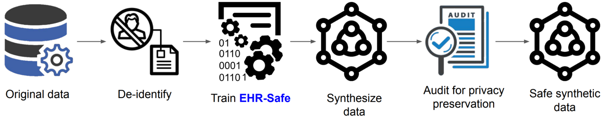

## ChatGPT: The latest AI-based language model developed by openai. [^1]

ChatGPT is a variant of the GPT (Generative Pre-training Transformer) language model designed to handle longer-form text, specifically text written in characters instead of words. This makes it particularly well-suited for translation, machine writing, and language modeling tasks in languages that do not use spaces between words.

One of the key benefits of ChatGPT is its ability to handle out-of-vocabulary (OOV) words more effectively than traditional word-based language models. In a word-based model, OOV words can be a significant problem because they are not part of the model's vocabulary and therefore difficult to process. ChatGPT, on the other hand, can handle OOV words by treating them as a sequence of individual characters, allowing it to generate more accurate and coherent text.

Another advantage of ChatGPT is its ability to handle languages with a high degree of morphological complexity, such as inflection and word concatenation. In these languages, a single word can have multiple meanings depending on its inflection, and word boundaries may not always be clearly defined. ChatGPT is able to handle this complexity by processing text at the character level, allowing it to generate more accurate and natural-sounding text in these languages.

## Differential privacy: Preserving individual privacy in a world of data sharing. [^2]

Differential privacy is a concept in the field of computer science that refers to the practice of protecting the privacy of individuals in a dataset by adding noise to the data before it is analyzed. This noise helps to obscure the data of individual users, making it more difficult to identify or profile specific individuals within the dataset.

Differential privacy (DP) is a framework for measuring the privacy of an algorithm. It does this by quantifying the "privacy cost" of the algorithm, which refers to the amount of information about an individual that is leaked as a result of running the algorithm.

Composition is a key property of DP that reflects the net privacy cost of a combination of DP algorithms when they are viewed as a single algorithm. An example of this is the differentially-private stochastic gradient descent (DP-SGD) algorithm, which trains machine learning models over multiple iterations, each of which is differentially private. The basic composition theorem in DP states that the privacy cost of a collection of algorithms is, at most, the sum of the privacy cost of each individual algorithm. However, this can often be a gross overestimate, and several improved composition theorems have been developed to provide better estimates of the privacy cost of composition. These theorems help to more accurately understand the privacy cost of a combination of DP algorithms and ensure that it does not exceed certain thresholds.

## EHR-Safe: Realistic EHR data for research and analysis, without compromising patient privacy. [^3]

EHR-Safe is a tool for generating synthetic electronic health records (EHRs) that are both high-fidelity and privacy-preserving. It is designed to allow researchers and analysts to work with real-world EHR data without exposing the sensitive personal information of individual patients.

One of the key features of EHR-Safe is its ability to generate synthetic EHRs that are indistinguishable from real EHRs. This is achieved through the use of advanced machine learning techniques that are trained on real EHR data. The resulting synthetic EHRs are able to capture the structure, variability, and complexity of real EHRs, making them an ideal tool for research and analysis.

In addition to its ability to generate high-fidelity synthetic EHRs, EHR-Safe is also designed to protect the privacy of individual patients. It does this through the use of differential privacy techniques, which add noise to the data in order to obscure the data of individual patients. This helps to ensure that the sensitive personal information of individual patients is not exposed while still allowing researchers to work with real-world EHR data.

## RT-1: Revolutionizing robotics with flexible, adaptable, and autonomous models. [^4]

Recent advances in machine learning (ML) research, such as computer vision and natural language processing, have been enabled by the use of large, diverse datasets and expressive models. However, this approach has not yet been successfully applied to robotics due to a lack of large-scale and diverse robotic data and the lack of expressive, scalable, and fast models that can learn from this data and generalize effectively. Data collection for robotics is particularly expensive and challenging, and there is a need for more expressive and fast models that can learn from this data in real-time.

Robotics Transformer 1 (RT1) aims to revolutionize the field of robotics by enabling the development of robots that are more flexible, adaptable, and autonomous based on the transformer architecture.

Key features of RT1: 
ability to process a wide range of sensory inputs, including visual, auditory, and tactile data. This allows it to perceive and interact with its environment in a more natural and intuitive way, making it better suited for tasks such as object recognition and manipulation.
ability to adapt to changing environments and tasks. It is able to learn from experience and make adjustments to its behavior in order to better accomplish its goals. This makes it more flexible and adaptable than many traditional robotics systems, which are typically hard-coded to perform specific tasks.

## CICERO: Empowering human-AI cooperation through negotiation and persuasion. [^5]

CICERO is an AI agent that has achieved human-level performance in the strategy game Diplomacy. CICERO demonstrated this by ranking in the top 10% of participants on webDiplomacy.net, an online version of the game. CICERO's success in Diplomacy is notable because it requires players to understand other people's motivations and perspectives, make complex plans, and use natural language to negotiate and form alliances with other players. CICERO is so effective at using natural language to negotiate in the game that other players often preferred working with it over other human participants.

[^1]: [https://openai.com/blog/chatgpt/](https://openai.com/blog/chatgpt/)
[^2]: [https://ai.googleblog.com/2022/12/differential-privacy-accounting-by.html](https://ai.googleblog.com/2022/12/differential-privacy-accounting-by.html)
[^3]: [https://ai.googleblog.com/2022/12/ehr-safe-generating-high-fidelity-and.html](https://ai.googleblog.com/2022/12/ehr-safe-generating-high-fidelity-and.html)
[^4]: [https://ai.googleblog.com/2022/12/rt-1-robotics-transformer-for-real.html](https://ai.googleblog.com/2022/12/rt-1-robotics-transformer-for-real.html)
[^5]: [https://ai.facebook.com/blog/cicero-ai-negotiates-persuades-and-cooperates-with-people/](https://ai.facebook.com/blog/cicero-ai-negotiates-persuades-and-cooperates-with-people/)