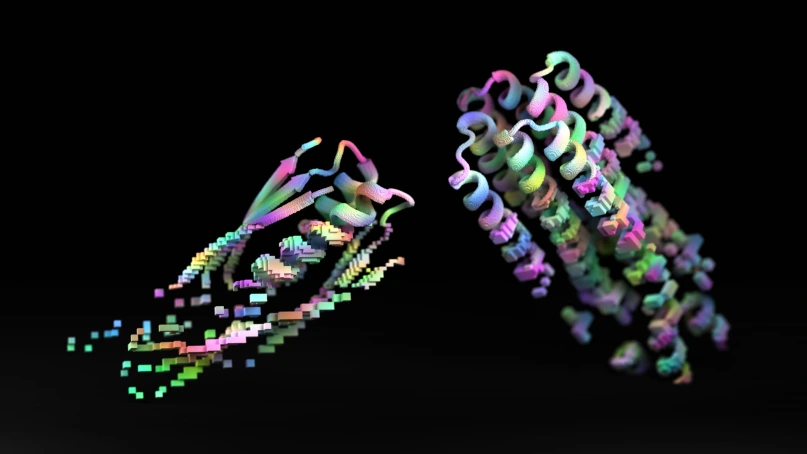
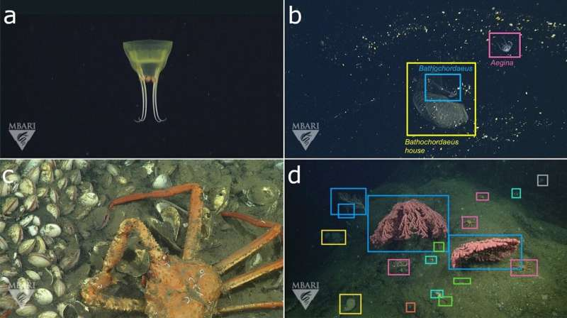

## An AI that can help to design new proteins and to unleash new cures and accouterments. [^1]

A group of experimenters from the University of Washington described a new tool ProteinMPNN, which could help experimenters discover preliminarily unknown proteins and design entirely new bones. It will open an entire new macrocosm of possible proteins for experimenters to design from scratch. 

ProteinMPNN will help experimenters with the inverse problem. Machine literacy will make the whole process a lot more hastily and light, and will allow experimenters to produce fully new proteins and structures on a much larger scale. 

## An Open Source Unified Language Learner [^2]

Google researchers have presented a novel language pre-training paradigm called Unified Language Learner that improves the performance of language models universally across datasets and setups. Building models that understand and generate natural language well is one of the grand goals of machine learning research. Improving the quality of our language models is a key target for researchers to make progress toward such a goal.

## AI can detect drunkenness by evaluating infrared images of human faces with 93% accuracy [^3]

Artificial intelligence has developed a way to detect whether a person is drunk or not using thermal imaging. The technology could be used by police to screen people in city centers or at events where alcohol is likely to have been consumed. Thermal imaging offers a less ambiguous approach that is also non-invasive, researchers say. 

Any system designed to identify inebriated people must have a very low rate of false positives and false negatives. After all, a false negative might see a drunk person driving their car whereas too many false positives would lead to frustration and a loss of trust in the system among the public.

## An open-source image database that unlocks the power of AI for ocean exploration [^4]

Fathom Net is an open-source image database that uses state-of-the-art data processing algorithms to help process the backlog of visual data. Using artificial intelligence and machine learning will alleviate the bottleneck for analyzing underwater imagery and accelerate important research around ocean health. 

Recent advances in machine learning enable fast, sophisticated analysis of visual data. Still, the use of AI in ocean research has been limited by the lack of a standard set of existing images that could be used to train the machines to recognize and catalog underwater objects and life. This will surely help in ocean cleaning.

## How AI image generators could help robots [^5]

The field of AI-generated art can be traced back as far as the 1960s with early attempts using symbolic rule-based approaches to make technical images. The way these generative models generate images: initially, you have this really nice image, where you start from this random noise, and you basically learn how to simulate the process of how to reverse this process of going from noise back to your original image, where you try to iteratively refine this image to make it more and more realistic.

The researchers describe how these models can work wrt to robotics: as you can generate different images, you can also generate different robot trajectories (the path and schedule), and by composing different models together, you are able to generate trajectories with different combinations of skills. If I have natural language specifications of jumping versus avoiding an obstacle, you could also compose these models together, and then generate robot trajectories that can both jump and avoid an obstacle.

[^1]: [https://www.technologyreview.com/2022/09/15/1059550/an-ai-that-can-design-new-proteins-could-help-unlock-new-cures-and-materials/](https://www.technologyreview.com/2022/09/15/1059550/an-ai-that-can-design-new-proteins-could-help-unlock-new-cures-and-materials/)
[^2]: [https://ai.googleblog.com/2022/10/ul2-20b-open-source-unified-language.html](https://ai.googleblog.com/2022/10/ul2-20b-open-source-unified-language.html)
[^3]: [https://techxplore.com/news/2022-10-ai-network-drunkenness-infrared-images.html](https://techxplore.com/news/2022-10-ai-network-drunkenness-infrared-images.html)
[^4]: [https://techxplore.com/news/2022-10-open-source-image-database-power-ai.html](https://techxplore.com/news/2022-10-open-source-image-database-power-ai.html)
[^5]: [https://techxplore.com/news/2022-10-ai-image-robots.html](https://techxplore.com/news/2022-10-ai-image-robots.html)
