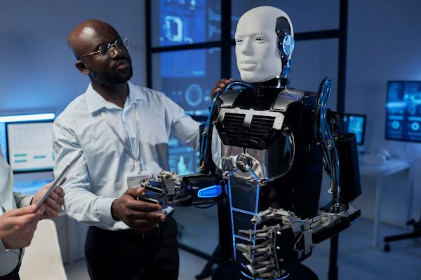

December 2024 saw AI’s growing role across industries—from humanoid robotics and healthcare transformation to Bitcoin strategies by tech giants. The highlights showcase AI's potential and the evolving digital economy landscape.

# December 2024: AI’s Rising Impact Across Sectors

## Indian IT Hiring Boom for 2025 [^1]
India’s IT sector is set for a major rebound in 2025, with AI and data science roles leading the hiring surge. Upskilling in AI and cloud technologies is now critical for career growth.

## Alteryx's Vision for AI-Driven Data Preparation [^2]
Alteryx’s new CEO envisions a platform blending AI-driven data prep and analytics, empowering both technical and non-technical users in the era of digital transformation.

## OpenAI’s Move into Humanoid Robots [^3]
OpenAI is reportedly venturing into humanoid robotics, aiming to integrate its AI models into physical robots capable of performing complex tasks in dynamic environments.

## December 25th Tech Highlights [^4]
Key updates include AI’s expansion in healthcare, cybersecurity challenges during the festive season, EV battery innovations, and tech giants preparing major AI and AR/VR announcements for 2025.

## Tech Giants Betting Big on Bitcoin [^5]
Companies like Rumble Inc., MicroStrategy, and Marathon Digital are increasing Bitcoin allocations, positioning crypto assets as strategic financial reserves amid bullish market sentiment.

## India’s Semiconductor Industry Surge [^6]
India will need over 30,000 skilled professionals to support its growing semiconductor sector, driven by government incentives and increasing global demand.

## AI's Revolution in Hollywood CGI [^7]
AI is transforming Hollywood filmmaking with hyper-realistic CGI and faster production pipelines, though concerns over creativity and employment ethics remain.

## Conclusion
December 2024 captured the transformative power of AI and emerging technologies across fields. From IT hiring booms to humanoid robotics, the digital future promises innovation and fresh challenges.

## References
[^1]: [Indian IT Hiring 2025](https://economictimes.indiatimes.com/jobs/hr-policies-trends/indian-it-hiring-2025-promises-rebound-ai/data-science-roles-to-dominate-job-market/articleshow/116619527.cms?from=mdr)

[^2]: [Alteryx AI Data Platform](https://www.techtarget.com/searchbusinessanalytics/news/366617637/New-Alteryx-CEO-sees-platform-as-the-canvas-for-AI-prep)

[^3]: [OpenAI Exploring Humanoid Robots](https://www.financialexpress.com/life/technology-openai-might-enter-the-humanoid-robot-heres-all-we-know-3700828/)

[^4]: [Tech Highlights December 25](https://www.livemint.com/technology/latest-technology-news-today-on-december-25-2024-live-updates-11735084814000.html)

[^5]: [Tech Giants Bet Big on Bitcoin](http://www.globenewswire.com/news-release/2024/12/26/3001955/0/en/Tech-Companies-Embracing-Bitcoin-Treasuries-as-a-Strategic-Asset-as-Market-Heats-up-Heading-into-2025.html)

[^6]: [India’s Semiconductor Demand](https://timesofindia.indiatimes.com/city/ahmedabad/indias-semiconductor-sector-will-need-over-30k-trained-personnel/articleshow/116481382.cms)

[^7]: [AI's Role in Hollywood CGI](https://www.nytimes.com/2024/11/01/magazine/ai-hollywood-movies-cgi.html)
