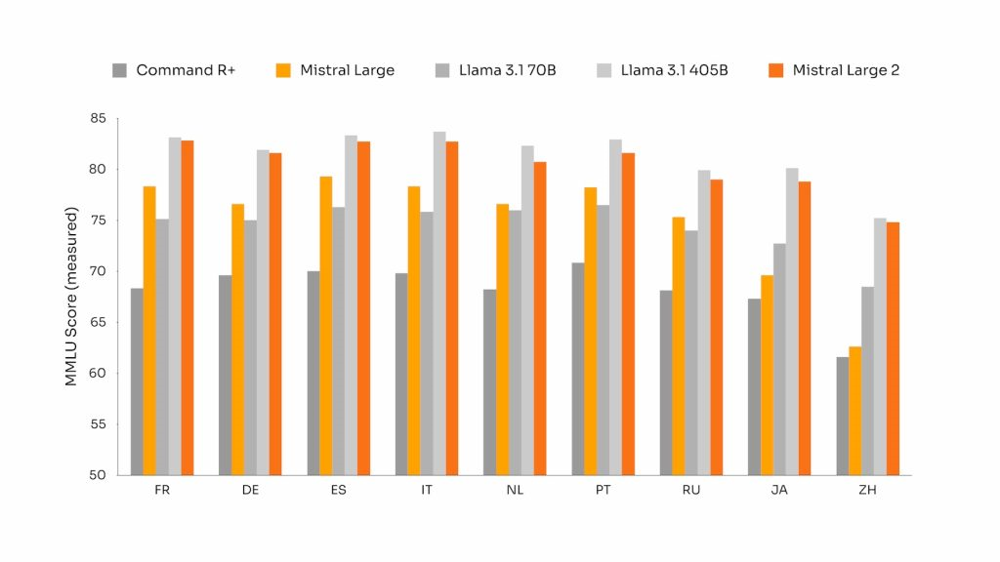
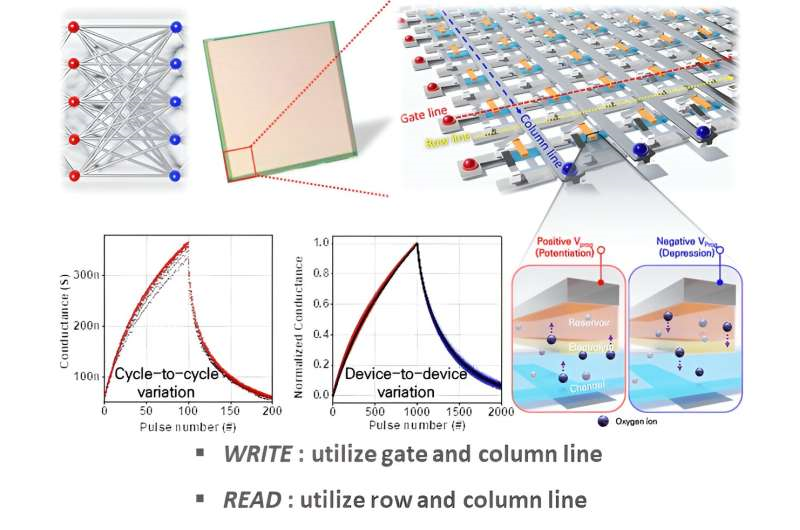
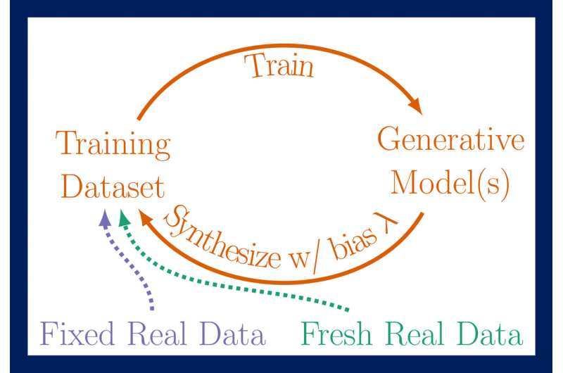

July 2024 was marked by remarkable advancements in AI technology, from Google's powerful new AI model to breakthroughs in semiconductor technology. While these developments promise to reshape industries, they also raise important ethical and regulatory questions. This month's highlights explore these trends in depth.

# July 2024: A Month of AI Innovation and Ethical Considerations

## Google’s New AI Model - Gemma 2 2B [^1]
Google has unveiled Gemma 2 2B, a compact yet highly effective AI model that rivals much larger models in performance. With 2.6 billion parameters and training on a 2 trillion token dataset, Gemma 2 2B demonstrates superior conversational abilities and is optimized for various hardware platforms.

## Mistral’s AI Model - Mistral Large 2 [^2]
Mistral AI has launched Mistral Large 2 (ML2), a model designed to compete with leading AI firms. Despite its smaller size, ML2 supports multiple languages and aims to reduce AI hallucinations, marking a significant step forward in AI development.

## Next Generation Semiconductor Technologies [^3]
A new breakthrough in semiconductor technology, Electrochemical Random Access Memory (ECRAM), could revolutionize AI efficiency. This development promises enhanced performance and lower power consumption, setting the stage for future AI advancements.

## The EU's Landmark AI Law [^4]
The European Union has introduced a groundbreaking AI regulation aimed at promoting innovation while safeguarding citizens' rights. Set to take effect in 2026, the law imposes stringent requirements on AI use, particularly in sensitive areas such as predictive policing.

## Challenges with Generative AI and the Internet [^5]
Generative AI models, including OpenAI's GPT-4o, face significant challenges such as the risk of creating synthetic data feedback loops. This phenomenon could disrupt internet data quality and poses a major concern for AI's future.

## AI-Driven Advancements in Nuclear Power [^6]
AI is playing a crucial role in reducing the time and cost associated with nuclear reactor design and licensing. This innovative approach could expedite the development of nuclear energy solutions by decades.

## Predicting Wildfires with AI [^7]
Researchers at USC have developed an AI-driven method to predict wildfire spread, combining satellite imagery with advanced AI algorithms. This new technique offers significant improvements in disaster management.

## OpenAI Whistleblowers and SEC Complaints [^8]
Whistleblowers have urged the SEC to investigate OpenAI over potentially illegal nondisclosure agreements, raising concerns about the company's transparency regarding AI risks.

## Conclusion
July 2024 has seen groundbreaking AI developments and significant ethical challenges. From Google's Gemma 2 2B to the EU's new AI law, these advancements will shape the future of AI. However, balancing innovation with ethical standards remains essential as AI continues to evolve.

[^1]: [Source Link 1](https://indianexpress.com/article/technology/artificial-intelligence/googles-new-small-ai-model-gemma-2-2b-surpasses-openais-gpt-3-5-9489169/)
[^2]: [Source Link 2](https://www.artificialintelligence-news.com/news/mistral-large-2-david-to-big-tech-goliaths/)
[^3]: [Source Link 3](https://techxplore.com/news/2024-08-gen-semiconductor-technology-high-efficiency.html)
[^4]: [Source Link 4](https://techxplore.com/news/2024-08-world-eu-ai-law.html)
[^5]: [Source Link 5](https://techxplore.com/news/2024-07-mad-generative-ai-internet.html)
[^6]: [Source Link 6](https://techxplore.com/news/2024-07-key-quicker-nuclear-power-artificial.html)
[^7]: [Source Link 7](https://techxplore.com/news/2024-07-scientists-ai-wildfire.html)
[^8]: [Source Link 8](https://techxplore.com/news/2024-07-openai-whistleblowers-sec-company-disclosure.html)
