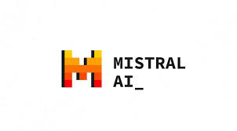
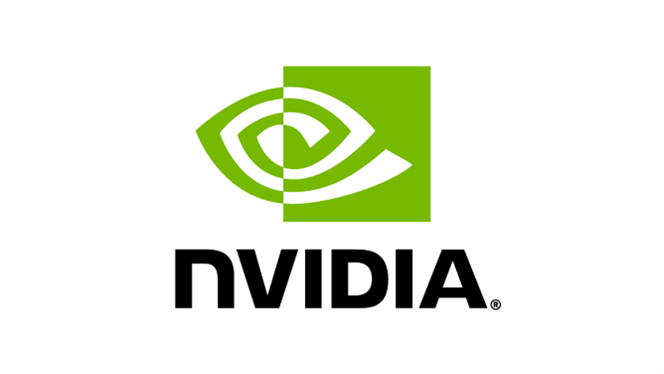
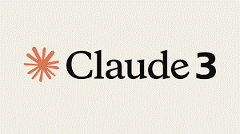

## Tech Innovations and Investments: Key Developments in June 2024

### Mistral AI Unveils Codestral: A Cutting-Edge Coding Model[^1]
Mistral AI has introduced Codestral, a generative AI model designed specifically for coding. Codestral is proficient in over 80 programming languages and features an impressive 32k context window, enhancing its performance in various benchmarks. This development signifies a substantial advancement in the realm of AI-driven coding assistance.

### China Launches $47 Billion Semiconductor Fund to Boost Tech Self-Sufficiency [^2]
China has allocated $47.48 billion to its largest-ever chip fund, aiming to bolster domestic semiconductor production. This investment is a crucial move toward achieving technological self-sufficiency and enhancing competitiveness in sectors like AI. The fund represents a significant step in China's strategic tech ambitions.

### Nvidia Surpasses Apple in Market Value, Reaching $3.01 Trillion[^3]
Nvidia's market capitalization has soared to $3.01 trillion, surpassing Apple and making it the world's second most valuable company. This leap is driven by the surge in artificial intelligence technology, highlighting Nvidia's pivotal role in the AI industry.

### Apple Introduces 'Apple Intelligence' at WWDC[^4]
Apple is set to reveal "Apple Intelligence," a new AI solution featuring chatbot capabilities similar to ChatGPT, during WWDC on June 10. This AI will be integrated into upcoming updates for iOS, iPadOS, and macOS and is designed to operate offline. The initiative marks a collaboration with OpenAI and promises enhancements to Siri.

### Stability AI Launches Stable Audio Open for Sound Generation[^5]
Stability AI has released "Stable Audio Open," an AI model that generates sound from text descriptions using royalty-free samples. This tool is intended for non-commercial use and opens new possibilities for creative audio projects.

### Microsoft Expands AI Dominance Under Nadella's Leadership[^6]
Under CEO Satya Nadella, Microsoft is aggressively expanding its AI capabilities by acquiring AI assets globally and developing proprietary technologies. This strategy includes investing in AI startups and recruiting top industry experts, positioning Microsoft as a formidable player in the AI landscape, potentially rivaling OpenAI.

### Lumalabs Introduces Luma Dream Machine for Video Synthesis[^7]
Lumalabs has launched the Luma Dream Machine, an AI model designed to create high-quality, realistic videos from text and images. Utilizing a transformer-based method optimized for video content, this tool represents a significant advancement in AI-driven video synthesis.

### Enhancing AI Character: Claude 3's Training for Ethical Interaction[^8]
Anthropic explores "character training" in the Claude 3 model, emphasizing attributes like curiosity and open-mindedness while ensuring harm avoidance. This training strategy aims to align AI behavior with ethical norms, enhancing its interactive capabilities in a flexible and responsible manner.

### Conclusion:
June 2024 has been marked by significant advancements in the tech industry. From Mistral AI's groundbreaking coding model, Codestral, to China's massive investment in semiconductor production, and Nvidia's milestone as the second most valuable company, the month has seen pivotal developments. Apple is entering the AI market with "Apple Intelligence," while Stability AI and Lumalabs are pushing creative boundaries in sound and video generation. Microsoft continues to solidify its AI empire under Nadella's leadership, and Anthropic is making strides in ethical AI interaction with the Claude 3 model. These innovations highlight a dynamic and rapidly evolving technological landscape.

[^1]: [Mistral AI](https://mistral.ai/news/codestral/)

[^2]: [TechXplore](https://techxplore.com/news/2024-05-china-invests-billion-largest-chip.html)

[^3]: [The Verge](https://www.theverge.com/2024/6/5/24172363/nvidia-apple-market-cap-valuation-trillion-ai)

[^4]: [PCMag](https://www.pcmag.com/news/apple-keeps-it-simple-will-call-its-ai-apple-intelligence)

[^5]: [TechCrunch](https://techcrunch.com/2024/06/05/stability-ai-releases-a-sound-generator/?guccounter=1)

[^6]: [WSJ](https://www.wsj.com/tech/ai/microsoft-nadella-openai-inflection-9727e77a)

[^7]: [Lumalabs](https://lumalabs.ai/dream-machine)

[^8]: [Anthropic](https://www.anthropic.com/research/claude-character)

