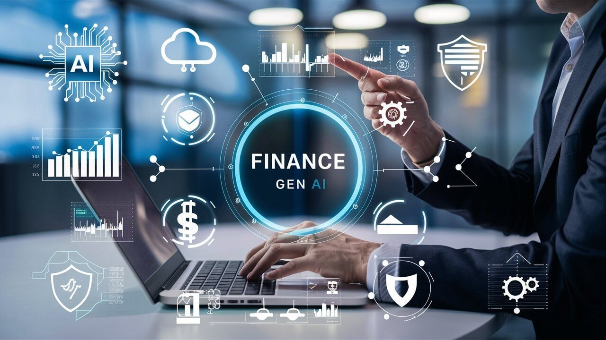

November 2024 showcased critical AI and tech advancements, from AI security research initiatives to breakthrough innovations in quantum computing and finance. This month’s highlights reflect the rapid evolution of AI across industries, emphasizing both potential and caution.

# November 2024: AI's Expanding Frontiers

## UK Establishes LASR for AI Security [^1]
The United Kingdom launched the Laboratory for AI Security Research (LASR) to mitigate AI-driven threats, receiving £8.22 million in initial funding. LASR aims to collaborate across sectors, strengthening defenses against malicious AI usage.

## Generative AI in the Fragrance Industry [^2]
NotCo and Cramer introduced the Generative AI Fragrance Formulator, revolutionizing perfume creation. This AI tool democratizes scent formulation, offering creators innovative, personalized fragrance options.

## Generative AI: C-Suite vs. Practitioners Divide [^3]
A report by Publicis Sapient revealed differing views on AI adoption: executives show optimism, while practitioners remain cautious about ethical and operational challenges. Bridging this divide is key to responsible AI growth.

## YeagerAI Launches the Intelligent Oracle [^4]
YeagerAI’s Intelligent Oracle enhances blockchain integration, offering real-time, secure, and AI-powered data for decentralized applications, with implications across DeFi, supply chains, and gaming.

## Quantum-AI Synergy Breakthroughs [^5]
Quantum computing and AI integration saw major progress. Quantum-enhanced AI models are solving complex problems in healthcare, finance, and logistics, despite challenges like decoherence and hardware limitations.

## Generative AI Transforming Finance [^6]
Financial services leveraged generative AI to advance algorithmic trading, risk management, customer service, and fraud detection, hinting at a smarter, faster financial ecosystem.

## Conclusion
November 2024 reflected AI’s increasing integration into diverse sectors—from national security to creative industries—while highlighting the urgent need for ethical vigilance and cross-sector collaboration.

## References
[^1]: [UK Establishes LASR](https://www.artificialintelligence-news.com/news/uk-establishes-lasr-counter-ai-security-threats/)

[^2]: [GenAI in Fragrance Formulators](http://www.trendhunter.com/slideshow/november-2024-tech)

[^3]: [C-Suite and Practitioners Divide](http://www.artificialintelligence-news.com/)

[^4]: [YeagerAI Launches the Intelligent Oracle](http://www.artificialintelligence-news.com/)

[^5]: [Quantum-AI Synergy](https://www.bbrief.co.za/2024/10/15/quantum-computing-ai/)

[^6]: [Generative AI in Finance](https://www.fintechfutures.com/2024/11/november-2024-top-five-ai-stories-of-the-month/)
