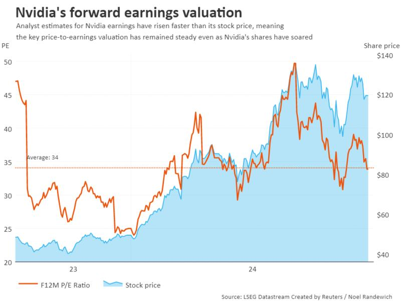
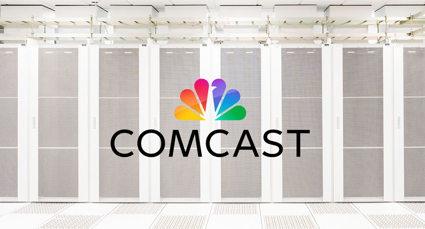

September 2024 saw key advancements in AI, geopolitical maneuvers involving AI technologies, and a significant regulatory push towards global AI governance. From the UAE and Saudi Arabia securing Nvidia AI chips to the UN's call for a global AI regulatory body, this month marked pivotal moments in the AI space.

# September 2024: Key AI Advancements and Strategic Moves

## UAE and Saudi Arabia Advance AI Ambitions with U.S.-Approved Nvidia Chips [^1]
Both the UAE and Saudi Arabia have secured, or are close to securing, access to Nvidia’s advanced AI chips, enabling them to develop high-performance AI models critical to their long-term AI strategies.

Key Points:
- **UAE’s AI Infrastructure**: The UAE secured Nvidia H100 chips for G42, its leading AI company, despite U.S. export restrictions to the Gulf region. G42’s secure data centers played a pivotal role in gaining U.S. approval.
- **Saudi Arabia’s Progress**: Saudi Arabia is optimistic about acquiring Nvidia H200 chips, aligning with its Vision 2030 initiative.
- **Strategic Moves**: G42 severed ties with Chinese companies, investing in secure data centers developed in partnership with Microsoft.

## Global AI Governance Proposed by the UN [^2]
In September 2024, the United Nations emphasized the need for global AI regulation, comparing the initiative to climate change governance. The proposed global AI governance body would create international standards for AI development, address risks, and promote ethical usage.

Key Aspects:
- **Global AI Governance Body**: A dedicated entity to monitor AI advancements and regulations.
- **Standards for AI Development**: Guidelines for safe AI use, ethics, and minimizing harms such as biases.
- **Support for Developing Nations**: Assistance to poorer nations in building AI infrastructure and governance.

## Nvidia Suffers $279 Billion Loss in One Day [^3]
Nvidia experienced a historic market collapse in September 2024, losing $279 billion in market capitalization in a single day—the largest one-day loss in U.S. stock market history—triggered by a U.S. Department of Justice (DOJ) antitrust investigation.

Key Points:
- **DOJ Antitrust Investigation**: Concerns over Nvidia’s market dominance in the AI sector.
- **Revenue Growth**: Despite strong earnings, smaller-than-expected outperformance led to investor concerns.
- **Broader Market Impact**: The sell-off was exacerbated by weak manufacturing data and economic concerns.

## Comcast’s New JANUS Initiative [^4]
Comcast's Janus Initiative aims to transform its core network infrastructure, leveraging virtualization and AI-powered self-healing capabilities to enhance network performance and sustainability.

Key Features:
- **Virtualization of Core Network**: Shift of core routing and switching functions to edge cloud platforms.
- **AI-Powered Self-Healing**: Real-time monitoring and automatic rerouting to ensure service continuity.
- **Sustainability Goals**: Support Comcast's efforts to become carbon-neutral by 2035.

## $30B Investment in AI by Microsoft and BlackRock [^5]
Microsoft and BlackRock have launched a $30 billion fund to invest in AI infrastructure, focusing on building data centers and energy projects to meet the growing computational demands of advanced AI models.

Key Points:
- **AI Investment Fund**: Aimed at AI infrastructure projects to enhance AI supply chains.
- **High Computational Needs**: Support for data centers equipped for deep learning and large-scale data processing.
- **Mobilization of Funds**: The partnership could mobilize up to $100 billion, including debt financing.

## Conclusion
September 2024 has been marked by significant AI advancements, strategic investments, and increasing regulatory scrutiny. The growing intersection of technology, geopolitics, and ethics will shape the future of AI in the months and years to come.

## References
[^1]: [UAE and Saudi Arabia Secure Nvidia AI Chips](https://theaitrack.com/uae-and-saudi-arabia-get-nvidia-ai-chips/)

[^2]: [Global AI Governance Proposed by the UN](https://www.ansi.org/standards-news/all-news/2024/09/9-23-24-un-releases-proposed-framework-for-global-ai-governance)

[^3]: [Nvidia Suffers $279 Billion Loss](https://www.business-standard.com/companies/news/nvidia-suffers-279-billion-loss-in-one-day-due-to-these-factors-explained-124090400728_1.html)

[^4]: [Comcast’s Janus Initiative](https://www.thefastmode.com/technology-solutions/37393-comcast-transforms-internet-experiences-with-janus-initiative-to-virtualize-core-network)

[^5]: [Microsoft and BlackRock $30B AI Investment](https://theaitrack.com/ai-news-september-2024-in-depth-and-concise-duplicate/)
