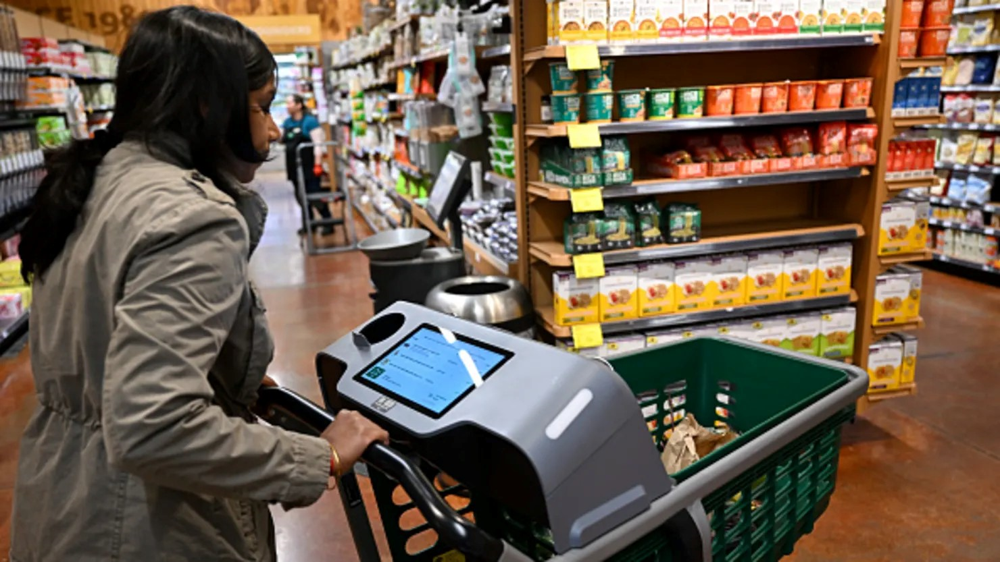
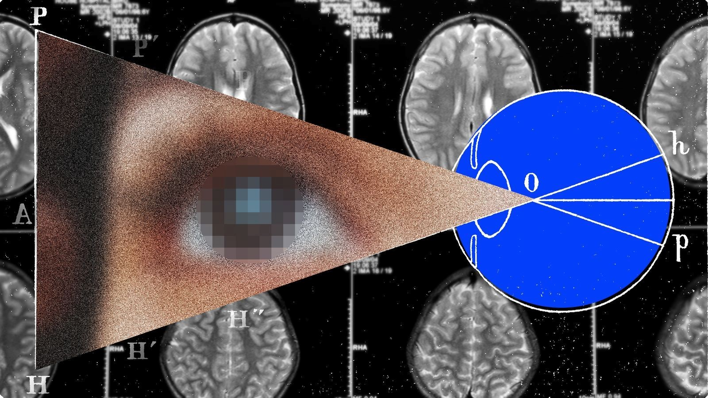

April 2025 witnessed dynamic shifts across the tech and AI landscape — from major debates about AI-generated art to innovations in medical AI, brain implants, and augmented reality therapies. Here's a deep dive into the highlights.

# April 2025: Democratization and Disruption in Tech

## Sam Altman Defends AI Art [^1]
OpenAI CEO Sam Altman praised AI-generated art for democratizing creativity, acknowledging challenges for traditional artists but emphasizing new opportunities for broader participation in creative industries.

## Amazon Expands Smart Grocery Carts [^2]
Amazon began selling its Dash smart carts to third-party retailers. These carts use computer vision and sensors to track purchases in real time, extending cashier-less shopping technology beyond Amazon-owned stores.

## Virtual Therapy for Teen Anxiety [^3]
An augmented reality app developed by Cardiff Youth Service aims to reduce anxiety among teenagers. Early trials show improved social interaction and emotional well-being among users.

## U.S. Inches Closer to TikTok Ban [^4]
The U.S. House passed a bill that could ban TikTok if ByteDance doesn’t divest ownership within 270 days, citing national security concerns. The bill faces further scrutiny in the Senate.

## Brain Implants for Artificial Vision [^5]
Companies like Neuralink and Cortigent are developing brain implants that bypass the eye to help blind individuals perceive basic visual cues, despite challenges around surgical risks and device longevity.

## AI Tackling Japan’s Labour Shortages [^6]
Facing an aging population, Japan is deploying AI technologies in industries like food manufacturing and agriculture to mitigate labor shortages, enhancing efficiency while preserving human roles.

## Smart Motorways Safety Concerns [^7]
England’s smart motorways, designed to ease traffic congestion, face criticism over frequent technology failures that put stranded drivers at risk. New investments are planned to improve safety measures.

## Google and Bayer Partner on Medical AI [^8]
Google Cloud partnered with Bayer to launch an AI platform that assists radiologists by flagging potential issues in medical scans and summarizing patient histories, aiming to ease healthcare workloads.

## Conclusion
April 2025 reinforced the tech sector's dual narrative: innovation surging ahead alongside debates about safety, ethics, and equitable access. As AI technologies become further entwined with society, the balance between progress and responsibility remains pivotal.

## References
[^1]: [Sam Altman Defends AI Art](https://indianexpress.com/article/technology/artificial-intelligence/sam-altman-defends-ai-art-ghibli-backlash-podcast-interview-9930216/)

[^2]: [Amazon Smart Grocery Carts](https://www.cnbc.com/2024/04/17/amazon-starts-selling-smart-grocery-carts-to-other-retailers.html)

[^3]: [AR Therapy for Teen Anxiety](https://www.bbc.com/news/articles/c4g40wwn54eo)

[^4]: [U.S. TikTok Ban Bill](https://readwrite.com/us-inches-closer-to-a-tiktok-ban/)

[^5]: [Brain Implants for Artificial Vision](https://www.wired.com/story/the-next-frontier-for-brain-implants-is-artificial-vision-neuralink-elon-musk/?utm_source=theaicitizen.com&utm_medium=newsletter&utm_campaign=this-week-s-top-ai-tech-news-and-trends)

[^6]: [AI Tackles Japan’s Labour Shortages](https://www.bbc.com/news/business-68225115)

[^7]: [Smart Motorways Safety Concerns](https://www.bbc.com/news/uk-68848418)

[^8]: [Google Partners with Bayer on AI for Radiology](https://www.cnbc.com/2024/04/09/google-partners-with-bayer-on-new-ai-product-for-radiologists.html)
