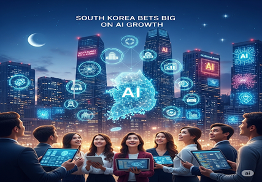
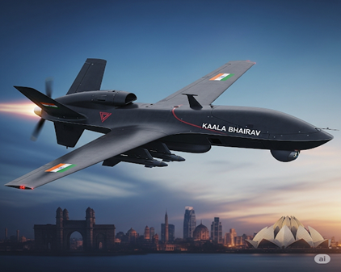
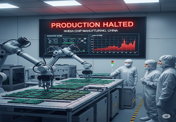
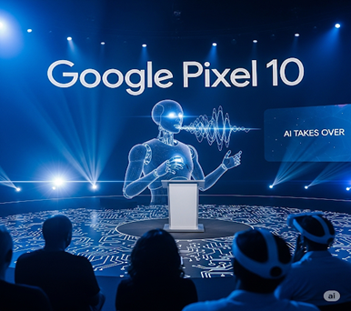

August 2025 showcased AI's transition from experimental technology to a core driver of national strategy, economic growth, and geopolitical competition, as nations worldwide made unprecedented investments while grappling with the challenges of AI-human workforce integration.

# August 2025: AI Becomes Central to National Strategy

## 1. South Korea Bets Big on AI Growth [^1]

South Korea has made AI investment its top national economic priority with the announcement of a massive 100 trillion won ($71.6 billion) public-private fund dedicated to AI development. This ambitious initiative will drive 30 large-scale projects across robotics, drones, autonomous vehicles, and home appliances.

The plan represents more than just technological advancement—it's a comprehensive strategy to revitalize South Korea's slowing economy. With current growth forecasts hovering at 0.9%, officials hope AI can boost economic growth to 3% in the coming years. If successful, South Korea could position itself as one of the top three global AI powers, competing directly with the U.S. and China.

This development highlights a critical trend: AI has evolved beyond innovation to become explicit national policy, with countries viewing AI capabilities as essential to economic competitiveness and strategic autonomy.

## 2. India's Strategic AI Defense Breakthrough: Kaala Bhairav Combat Drone [^2]

In a landmark achievement for indigenous defense technology, India unveiled its first AI-powered combat drone, Kaala Bhairav. Developed by Bengaluru-based Flying Wedge Defence and Aerospace, this system represents a major milestone in India's quest for strategic autonomy in defense manufacturing.

The drone boasts impressive capabilities including 30-hour endurance for extended surveillance and combat missions, AI-driven swarm coordination enabling multiple drones to execute simultaneous strikes, and cost efficiency that delivers comparable capabilities to U.S. Predator drones at a fraction of the cost.

Named after the fierce Hindu deity symbolizing power and protection, Kaala Bhairav reflects India's growing emphasis on self-reliance under the Atmanirbhar Bharat (self-reliant India) vision. This launch positions India not just as a consumer of advanced defense technology, but as an emerging innovator in AI-powered warfare systems.

## 3. The AI Chip War Intensifies: Nvidia Suspends H20 Production in China [^3]

The ongoing AI chip competition between the U.S. and China reached a new inflection point when Nvidia halted production of its H20 chips in China. These chips were specifically engineered to navigate U.S. export controls while maintaining strong AI capabilities for the Chinese market.

However, Chinese regulators raised security concerns, pressuring Nvidia to cease production. Industry reports suggest an oversupply of chips in China and intensifying domestic competition as local firms accelerate efforts to fill the technological gap left by restricted foreign imports.

This development underscores a fundamental shift in global technology dynamics: semiconductor chips have transcended their role as mere hardware components to become critical strategic assets in international relations, with AI capabilities at the center of geopolitical maneuvering.

## 4. Consumer AI Revolution: Google Pixel 10 Redefines Smartphone Intelligence [^4]

Google's Pixel 10 launch event demonstrated AI's transformation of consumer technology experiences. The device showcases breakthrough capabilities including 100× AI-powered zoom with Pro Res enhancements, comprehensive Gemini AI integration across Google's ecosystem of apps, wearables, and smart home devices, and intelligent Qi2 charging that uses predictive AI to optimize battery life.

The Pixel 10 represents more than incremental smartphone advancement—it functions as a personal AI companion with intelligence woven throughout photography, productivity workflows, and device optimization. Google's approach illustrates how AI is becoming the foundational technology driving next-generation consumer experiences rather than an add-on feature.

## 5. AI Workforce Transformation: TikTok's Automation Strategy [^5]

TikTok's decision to lay off 300 employees in the UK, primarily from its trust and safety division, while replacing their functions with AI moderation systems, highlights the accelerating automation of knowledge work. The company positions this transition as necessary for compliance with the UK's new Online Safety Act, though critics question whether AI systems can match human moderators' understanding of cultural nuance and sensitive content.

Despite workforce reductions, TikTok's UK and European revenue increased 38%, suggesting that efficiency gains from AI automation can coexist with business growth. This development intensifies debates about AI's impact on employment in sectors previously considered resistant to automation, raising questions about the pace and management of technological displacement.

## 6. Vision for AGI: Sam Altman's Roadmap for Human-AI Coexistence [^6]

Sam Altman, CEO of OpenAI, articulated his vision for society's adaptation to Artificial General Intelligence (AGI). According to Altman, AI agents will assume responsibility for routine and repetitive tasks, enabling humans to concentrate on creativity, strategic thinking, and innovation. However, he emphasized that society must proactively address challenges including inequality, potential misuse, and complex ethical considerations.

Altman's perspective reinforces the understanding that AGI represents not merely a technological milestone but a comprehensive societal transformation requiring deliberate preparation and governance frameworks to ensure beneficial outcomes for humanity.

## 7. Big Tech Restructuring: Meta's Strategic AI Reorganization [^7]

Despite reporting record Q2 earnings, Meta has implemented a hiring freeze in its AI division while undergoing significant organizational restructuring. The company is consolidating operations into four major units: Superintelligence, Consumer AI Products, Infrastructure, and Long-term Research.

This marks the fourth major organizational reshuffle in six months, demonstrating that even AI industry leaders face challenges balancing innovation ambitions with operational efficiency and cost management. Investors are closely monitoring whether Meta's substantial AI investments will generate proportional returns in an increasingly competitive landscape.

## Core Considerations for AI's National Integration

As AI becomes central to national strategy and economic policy, several critical considerations emerge:

- **Economic Transformation**: Countries must balance AI investment with workforce transition support to manage technological displacement effectively.
- **Strategic Autonomy**: Nations are prioritizing indigenous AI capabilities to reduce dependence on foreign technology and maintain competitive advantages.
- **Geopolitical Competition**: AI capabilities are becoming measures of national power, driving policy decisions and international relations.
- **Regulatory Frameworks**: Governments must develop governance structures that promote innovation while addressing security, privacy, and ethical concerns.
- **Infrastructure Investment**: Massive capital allocation for AI infrastructure represents a fundamental shift in national economic priorities.

## Conclusion

August 2025 marked a defining moment where AI transitioned from experimental innovation to the cornerstone of national economic and strategic planning. South Korea's unprecedented $71.6 billion investment, India's indigenous defense AI breakthrough, and the intensifying U.S.-China chip competition demonstrate that AI capabilities are now viewed as essential to national competitiveness and security.

The simultaneous automation of knowledge work, as evidenced by TikTok's AI moderation strategy, alongside the restructuring challenges faced even by industry leaders like Meta, reveals the complex dynamics of AI integration. The central challenge moving forward will be managing this rapid technological acceleration while ensuring that the benefits are distributed equitably and that the risks of displacement and geopolitical tension are effectively mitigated.

The developments of August 2025 suggest we are entering an era where AI leadership directly correlates with national power and economic prosperity, making the responsible development and deployment of these technologies one of the most critical policy challenges of our time.

## References

[^1]: [South Korea Bets Big on AI Growth](https://www.reuters.com/world/asia-pacific/south-korea-makes-ai-investment-top-policy-priority-support-flagging-growth-2025-08-22/)
[^2]: [India's First AI Combat Drone – Kaala Bhairav](https://economictimes.indiatimes.com/news/defence/bengalurus-kaala-bhairav-combat-ai-drone-promises-30-hr-range-swarm-strike-power-and-strategic-autonomy-at-a-fraction-of-predator-drones-price/articleshow/123453552.cms?from=mdr)
[^3]: [Nvidia Suspends H20 Chip Production in China](https://nypost.com/2025/08/22/business/nvidia-halts-china-h20-chip-production-after-beijing-backlash/)
[^4]: [Google Pixel 10 Event – AI Takes Over](https://www.theverge.com/the-vergecast/764217/vergecast-google-pixel-10-event)
[^5]: [TikTok Replaces Moderators with AI](https://www.thescottishsun.co.uk/money/15243701/tiktok-mass-layoffs-uk-ai-replace-jobs/)
[^6]: [Sam Altman on Life with AGI](https://www.businessinsider.com/openai-sam-altman-predictions-how-ai-could-change-the-world-2025-1?)
[^7]: [Meta Freezes AI Hiring Amid Restructuring](https://www.marketwatch.com/story/meta-reportedly-freezes-its-ai-hiring-spree-amid-wider-restructuring-06779695)
