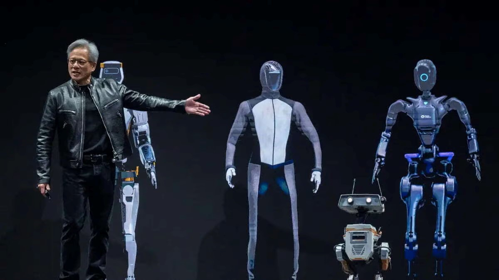

February 2025 captured major AI breakthroughs and strategic industry moves — from South Korea’s national AI infrastructure drive to cost-effective AI models challenging Nvidia’s dominance. Here's a detailed look at the month's major stories.

# February 2025: Accelerating Global AI Competition

## South Korea’s AI GPU Plan [^1]
South Korea announced plans to acquire 10,000 high-performance GPUs by the end of 2025 to strengthen its AI infrastructure. This initiative supports the country's push to stay competitive in the global AI race.

## DeepSeek Challenges Nvidia's Dominance [^2]
DeepSeek’s DeepSeek-R1 model, built on lower-end hardware, questioned the need for expensive AI infrastructure. This shift hints at a democratization of AI development and growing competition in the AI market.

## Elon Musk’s $97 Billion OpenAI Offer [^3]
Elon Musk proposed a $97.4 billion acquisition of OpenAI but threatened to withdraw the offer if the company retains its nonprofit status. Sam Altman and OpenAI firmly rejected Musk’s move.

## Scientists Develop 'Superhuman' Robotic Vision System [^4]
Researchers at the University of Pennsylvania unveiled "PanoRadar," a robotic vision system using spinning radio waves and AI to help robots navigate extreme environments like smoke and heavy rain.

## Nvidia's Strong Earnings Amid Market Caution [^5]
Nvidia posted a 78% surge in quarterly revenue, driven by AI chip demand. However, concerns about cheaper AI alternatives and tech investment slowdowns kept market sentiment cautious.

## Life After VMware: Search for Alternatives [^6]
Following Broadcom’s acquisition of VMware, enterprises are exploring alternatives like Nutanix, Microsoft Hyper-V, and Azure Stack HCI to future-proof IT strategies and avoid vendor lock-in.

## Google to Use AI for Age Verification [^7]
Google began testing AI models to estimate users’ ages for enhanced safety measures on platforms like YouTube, reflecting growing pressure for stronger child protection online.

## Conclusion
February 2025 highlighted the fast-paced evolution of the AI industry, democratization trends, and strategic repositioning across global tech landscapes. As competition heats up, innovation and regulation will continue shaping the digital world.

## References
[^1]: [South Korea’s AI GPU Plan](https://www.reuters.com/technology/artificial-intelligence/south-korea-aims-secure-10000-gpus-national-ai-computing-centre-2025-02-17/)

[^2]: [DeepSeek vs Nvidia](https://www.cnbc.com/2025/02/26/how-the-first-nvidia-earnings-day-after-deepseek-will-be-different.html)

[^3]: [Elon Musk OpenAI Offer](https://www.foxbusiness.com/technology/elon-musk-says-hell-drop-97b-openai-purchase-offer-chatgpt-maker-stays-nonprofit)

[^4]: [Superhuman Robotic Vision](https://www.weforum.org/stories/2025/02/robots-evs-gpus-technology-news-february-2025/)

[^5]: [Nvidia Earnings](https://www.reuters.com/technology/crucial-nvidia-results-set-course-faltering-magnificent-seven-2025-02-26/)

[^6]: [Life After VMware](https://www.forbes.com/sites/stevemcdowell/2025/02/06/life-after-vmware-which-alternative-is-right-for-you/?ss=digitaltransformation)

[^7]: [Google AI Age Verification](https://www.cnbc.com/2025/02/12/google-to-test-using-ai-to-determine-users-ages.html)
