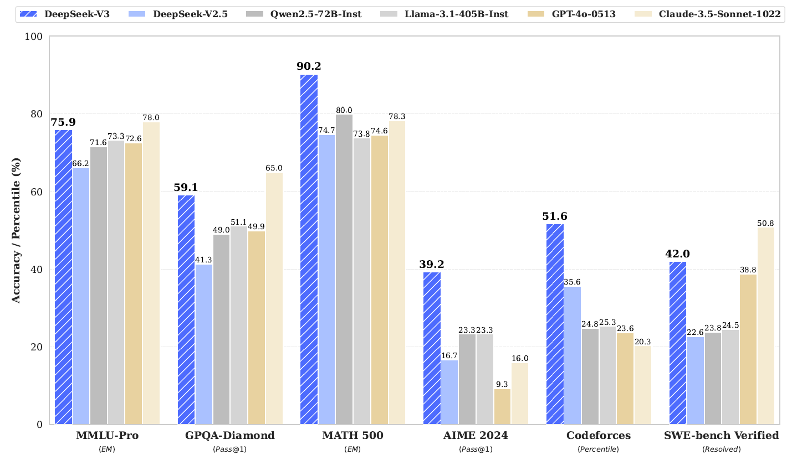
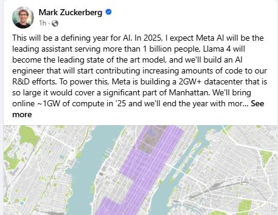
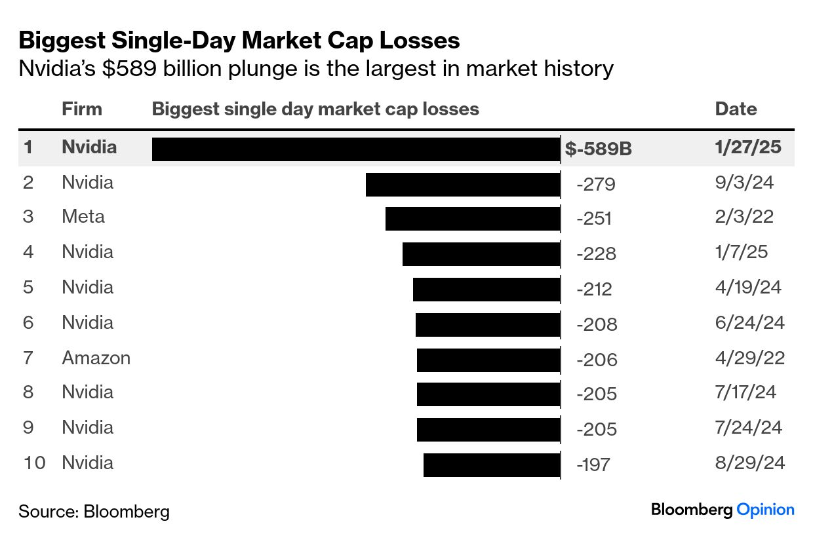
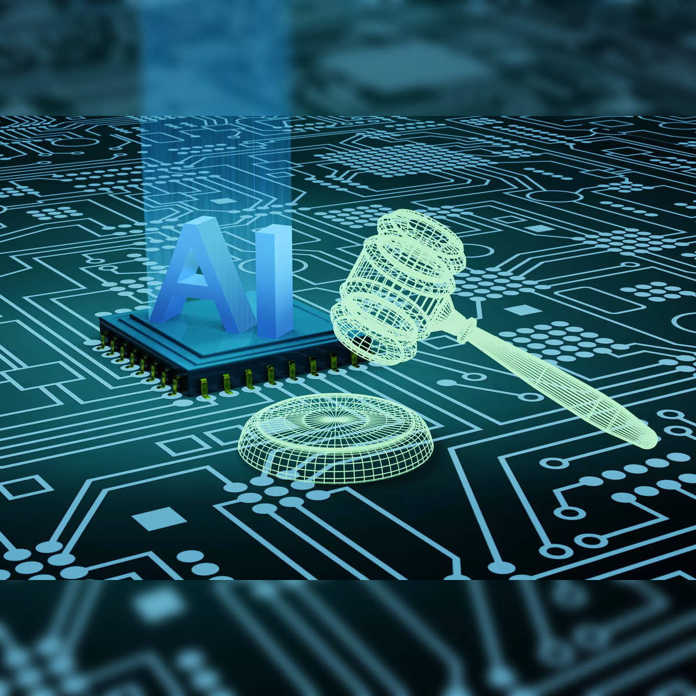

---

author: [Shubham, Kriva, Deepti, Sanidhya, Shravani, Pawan, Aisha]  
title: This Month in AI - January 2025  
lastmod: "2025-02-02"  
date: "2025-02-02"  
slug: tmai-january-2025  
description: Key advancements and challenges in AI during January 2025.  
categories: [Blog]  
tags: [Month in AI]  
image: poster.png  
aliases: [blog-january-2025]  

---

January 2025 saw several transformative developments in the field of AI, from DeepSeek’s remarkable chatbot performance to groundbreaking legislative actions addressing AI-generated content. Let’s dive into the highlights of the month that are shaping the AI landscape.

# January 2025: AI Innovation Meets Challenges

## DeepSeek's AI Assistant Surpasses ChatGPT [^1]  
DeepSeek's V3-powered AI Assistant gained significant traction, surpassing ChatGPT as the highest-rated free app on the iOS App Store in the United States. This chatbot, available on iOS and Android, excels in complex queries, logic problems, and code generation while being computationally efficient. This breakthrough positions DeepSeek as a strong competitor to industry leaders like OpenAI and Google.  

---

## Meta’s $65 Billion AI Investment Plan [^2]  
Meta announced an ambitious $65 billion investment in AI infrastructure, aiming to acquire 1.3 million GPUs and build a state-of-the-art data center in Louisiana. These efforts are geared toward scaling next-generation models like Llama 4 and integrating AI across Meta’s platforms, enhancing generative AI for content creation and moderation.  

---

## Stock Market Reactions to AI Developments [^3]  
January saw the stock market react to AI-driven events. Nvidia’s 17% drop, later recovering slightly, reflected concerns over DeepSeek’s cost-efficient AI models. Meanwhile, Constellation Energy, bolstered by AI-powered energy management solutions, saw initial gains but faced challenges due to operational cost concerns.  

---

## OpenAI Partners with National Labs to Advance Research [^4]  
OpenAI's collaboration with national labs highlights AI’s role in accelerating breakthroughs in science. Applications range from renewable energy material discovery to efficient data analysis, signaling AI’s expansion into advanced research domains.  

---

## AI-Powered Defense Technologies [^5]  
AI is revolutionizing military strategies. Companies like Palantir and Anduril are leveraging AI for intelligence gathering, surveillance, and autonomous defense systems. These technologies improve situational awareness and operational efficiency, shaping the future of defense capabilities.  

---

## AI-Generated Child Abuse Legislation in the UK [^6]  
The UK enacted laws targeting AI-generated child abuse content, addressing the rise of synthetic media exploitation. These laws introduce strict penalties for creators and distributors of such content, marking a milestone in regulating harmful AI applications.  

---

## The Pricing Dilemma of AI Tools [^7]  
AI firms face challenges in balancing affordability and profitability as computational costs rise. Companies are exploring tiered and usage-based pricing models to make AI tools accessible without undermining long-term R&D investments.  

---

## Meta’s Strategic Overhaul [^8]  
Meta introduced community-driven moderation while reducing reliance on third-party fact-checkers. These changes aim to promote free expression but raise concerns over misinformation and regulatory scrutiny. Meta's AI-focused strategies highlight its shift toward an innovation-driven future.  

---

## Conclusion  
January 2025 showcased the duality of AI innovation—transformative advancements alongside complex challenges. From DeepSeek's rise to the UK’s legislative response to AI risks, these developments highlight the need for a balanced approach to AI’s potential and responsibilities.

## References  
[^1]: [DeepSeek’s AI Assistant](#)  
[^2]: [Meta’s $65 Billion Investment](#)  
[^3]: [Stock Market AI Reactions](#)  
[^4]: [OpenAI Partnerships](#)  
[^5]: [Defense Technologies](#)  
[^6]: [UK AI Legislation](#)  
[^7]: [AI Pricing Challenges](#)  
[^8]: [Meta’s Overhaul](#)  
