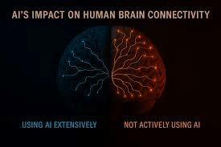

June 2025 highlighted India’s advancements in space, agriculture, AI policy, and infrastructure. From the historic ISS mission to debates over AI's cognitive impact, this month offered diverse developments with global implications.

# June 2025: AI Innovations Across Industries

## India Returns to Space: Group Captain Shubhanshu Shukla Becomes First Indian on ISS After 41 Years [^1]

On 25 June 2025, India made history as Group Captain Shubhanshu Shukla became the second Indian astronaut in space—41 years after Rakesh Sharma’s 1984 mission. The mission was part of the NASA-ISRO-ESA-SpaceX collaboration under Axiom-4.

He conducted seven Indian-led experiments on agriculture, biology, and space medicine aboard the ISS. ISRO called this a milestone towards India's 2027 human spaceflight and 2035 space station goals.

## Maharashtra Approves MahaAgri-AI 2025–29 to Revolutionize Agriculture [^2]

The Maharashtra Cabinet approved a five-year AI-based agriculture policy integrating generative AI, drones, robotics, and predictive analytics. Projects like Mahavedh (weather forecasting) and Digital Farming Schools are central to this initiative.

The aim is to improve productivity, resource use, and decision-making across rural areas.

## MIT Study Sparks Debate: Does ChatGPT Reduce Thinking Skills? [^3]

An MIT study suggested reduced cognitive engagement in users who frequently relied on ChatGPT. Participants using AI showed lower brain activity and essay performance over time.

Critics argue the study design was flawed, and AI should be used to support—not replace—strategic thinking. The study raises important questions for educators.

## AI to Transform Indian Airports [^4]

With surging air traffic, Indian airports are integrating AI for faster customs clearance (e.g., Mumbai clearing 25,000 passengers in 10 minutes), biometric boarding via Digi Yatra, and smart terminal design.

India’s airport innovations, such as AI tailgating prevention and modular design, are now influencing global best practices.

## AI Reshaping Digital Marketing [^5]

AI is being used across digital marketing—from chatbots and predictive content to AI-generated posts and image search. Companies report significant boosts in personalization, satisfaction, and efficiency.

84% of marketing teams now use or plan to expand AI adoption.

## Amazon Pilots Humanoid Delivery Robots [^6]

Amazon is testing humanoid robots for last-mile delivery via Rivian vans and Zoox robotaxis. These robots, powered by Amazon's AI software, may soon begin real-world deliveries after indoor testing.

The shift raises critical questions about automation, labor, and logistics efficiency.

## India's Big AI Moment in Education: Boon or Backfire? [^7]

Over 60% of Indian schools now use AI-powered edtech platforms. While they bring personalization, concerns remain about rote learning, rural access gaps, and critical thinking loss.

Experts stress balancing AI tools with core human skills like empathy, creativity, and judgment.

## Conclusion

June 2025 reflected India’s leadership in space, agriculture, and AI adoption. As AI continues to touch every sector—from education to logistics—it’s crucial to maintain ethical frameworks and ensure inclusive access.

## References

[^1]: [India Returns to Space](https://www.bbc.com/news/articles/cz09lx2gjm4o)  
[^2]: [MahaAgri-AI 2025–29 Policy](https://www.newsonair.gov.in/maharashtra-cabinet-approves-mahaagri-ai-2025-29-to-transform-agri-sector/)  
[^3]: [MIT Study on ChatGPT and Cognition](https://theconversation.com/mit-researchers-say-using-chatgpt-can-rot-your-brain-the-truth-is-a-little-more-complicated-259450)  
[^4]: [AI in Indian Airports](https://www.thehindu.com/business/technologies-to-shape-airport-experience-say-experts/article69661577.ece)  
[^5]: [AI in Digital Marketing](https://www.simplilearn.com/how-companies-are-using-artificial-intelligence-ai-in-digital-marketing-article)  
[^6]: [Amazon’s Humanoid Delivery Bots](https://www.ndtv.com/feature/end-of-human-delivery-workers-amazon-testing-humanoid-robots-that-spring-out-of-vans-8599932)  
[^7]: [AI in Indian Education](https://www.financialexpress.com/artificial-intelligence/the-big-ai-moment-for-education-has-arrived-could-it-backfire/3877366/)
