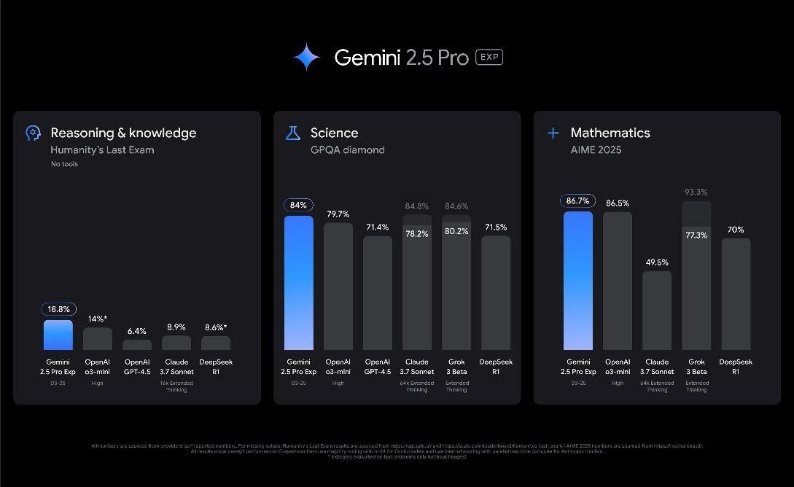
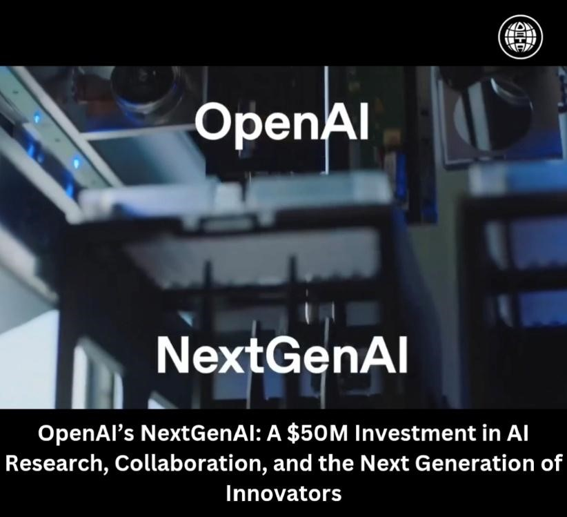

March 2025 brought transformative announcements in AI technology, with companies like Google, Nvidia, and OpenAI revealing innovations that signal the next wave of AI development and deployment.

# March 2025: Pushing the Boundaries of AI and Robotics

## Google Unveils Gemini 2.5 Pro and Gemini Robotics [^1]
Google launched Gemini 2.5 Pro with enhanced reasoning abilities and introduced Gemini Robotics, focusing on AI-powered robots capable of physical manipulation and navigation, marking a bold move into embodied AI.

## OpenAI Launches 'Operator' [^2]
OpenAI debuted "Operator," an AI assistant capable of autonomously handling complex online tasks, from grocery shopping to appointment booking, marking a major step towards semi-autonomous AI agents.

## Nvidia Showcases Blackwell Ultra and Vera Rubin Chips [^3]
At GTC 2025, Nvidia unveiled its next-gen AI chips—Blackwell Ultra and Vera Rubin—along with "Blue," a robot developed with Disney Research and DeepMind, driven by the Newton physics engine, pushing robotics simulations forward.

## China's Manus: A New Autonomous AI Agent [^4]
Chinese AI company Monica introduced Manus, an autonomous agent excelling at real-world tasks and setting new benchmarks for AI independence, showcasing China's growing prominence in AI development.

## OpenAI's $50M Investment in NextGenAI Consortium [^5]
OpenAI invested $50M to establish the NextGenAI Consortium, collaborating with 15 top institutions to drive AI-powered scientific discovery and education innovation.

## Morgan Stanley's Bullish AI Outlook [^6]
Morgan Stanley reinforced confidence in AI's growth, dismissing rumors of a slowdown and highlighting persistent high demand for AI chips, backed by leaders like Sam Altman and Sundar Pichai.

## BBC News Establishes AI Department [^7]
BBC News launched a dedicated AI division focused on personalizing news content for younger audiences, demonstrating the media industry's shift towards AI-enhanced journalism.

## World Economic Forum's Global Roadmap for Digital Safety [^8]
The World Economic Forum unveiled a global strategy for tackling online harms like misinformation and cyberbullying, promoting a safer and more resilient digital ecosystem worldwide.

## Conclusion
March 2025 reinforced the global momentum toward integrating AI into physical spaces, daily tasks, and digital ecosystems. These developments foreshadow a future of closer human-AI collaboration, balanced by a call for safety and ethical frameworks.

## References
[^1]: [Google Gemini 2.5 Pro and Robotics](https://blog.google/technology/ai/google-ai-updates-march-2025/)

[^2]: [OpenAI Operator Launch](https://www.crescendo.ai/news/latest-ai-news-and-updates)

[^3]: [Nvidia GTC 2025 Highlights](https://apnews.com/article/457e9260aa2a34c1bbcc07c98b7a0555)

[^4]: [Manus: China's Autonomous AI](https://www.crescendo.ai/news/manus-china-autonomous-ai-agent)

[^5]: [OpenAI's NextGenAI Consortium](https://www.artificialintelligence-news.com/2025/04/25/openai-invests-50m-nextgenai-consortium)

[^6]: [Morgan Stanley AI Investment Outlook](https://www.axios.com/2025/04/20/morgan-stanley-ai-investment-outlook)

[^7]: [BBC News Launches AI Department](https://www.theguardian.com/media/2025/apr/21/bbc-news-launches-ai-department)

[^8]: [World Economic Forum Digital Safety Roadmap](https://www.weforum.org/press/2025/04/wef-launches-global-digital-safety-roadmap)
