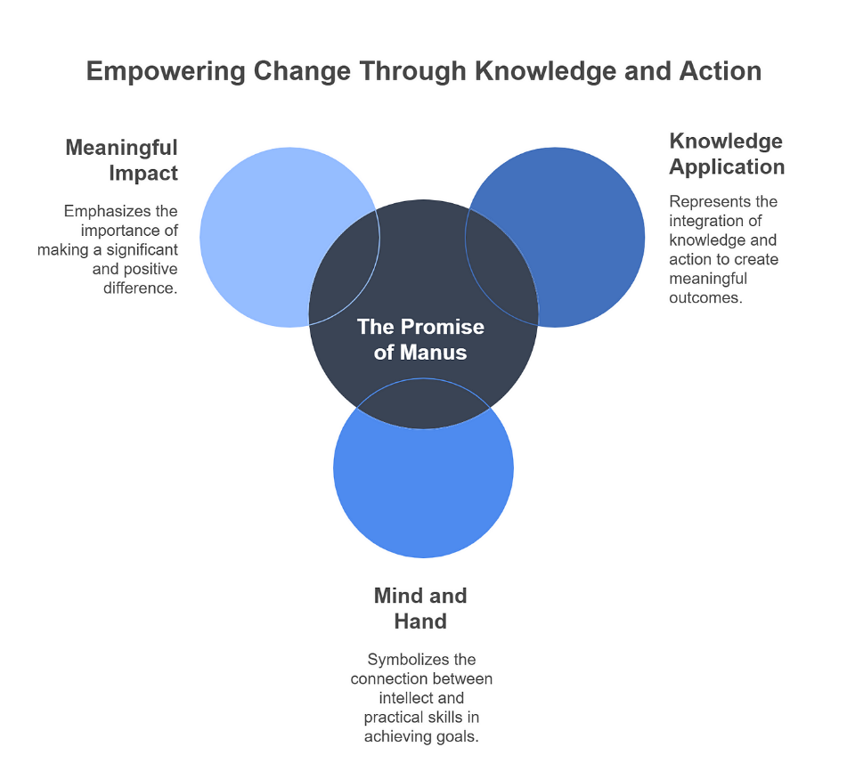

May 2025 was a month of major shifts in the AI ecosystem, from multibillion-dollar acquisitions and government-led initiatives to product breakthroughs and ethical regulations. Here's a round-up of the most impactful stories.

# May 2025: Global AI Momentum and Strategic Shifts

## OpenAI Acquires Jony Ive’s AI Hardware Startup 'io' [^1]
In a $6.5 billion acquisition, OpenAI purchased 'io', the AI hardware venture founded by former Apple designer Jony Ive. This strategic move signals OpenAI's intention to enter the AI-integrated device space. Ive will lead hardware design efforts at OpenAI, focusing on minimalist AI-powered devices that reduce screen dependency—such as a compact, screenless device equipped with a microphone and camera for environmental awareness.

## Google Enhances Gemini 2.5 Pro and Launches Veo 3 [^2]
At its developer conference, Google unveiled Veo 3, a sophisticated video generation model, and improved the capabilities of Gemini 2.5 Pro. Google DeepMind CEO Demis Hassabis highlighted the role of chip engineers in supporting these advanced models, emphasizing the demand as “overwhelming.”

## Saudi Arabia Launches 'Humain' to Propel AI Leadership [^3]
Saudi Arabia introduced 'Humain', an AI company under its Public Investment Fund aimed at developing AI infrastructure and Arabic language models. Strategic collaborations were formed with Nvidia, AMD, Qualcomm, Amazon Web Services, and Supermicro, totaling investments of over $25 billion to accelerate AI and data center development.

## Odisha Approves Comprehensive AI Policy-2025 [^4]
India’s Odisha state approved an AI policy targeting key sectors like healthcare, education, and disaster management. The policy promotes ethical AI use, skill development, and regulatory frameworks, and will be implemented by the 'Odisha AI Mission'.

## Anthropic Releases Claude 4 AI Model [^5]
Anthropic launched Claude 4, its most advanced AI yet, available in two variants: Claude Opus 4 and Claude Sonnet 4. These models can operate autonomously for hours, expanding possibilities in customer service, content generation, and research.

## DeepSeek Revolutionizes Healthcare in China [^6]
DeepSeek AI, deployed in China’s tertiary hospitals, has improved diagnostics, workflow, and patient management. In Meizhou, it cut hotline wait times by 28%. However, its rapid adoption also raises concerns over automation bias and regulatory oversight.

## Monica.im Unveils Manus AI – A Fully Autonomous Agent [^7]
Chinese startup Monica.im introduced Manus AI, capable of executing complex tasks from stock analysis to travel planning. Despite performance strengths, the agent faces stability issues, including frequent crashes and overloads.

## Australia Proposes AI Guardrails for High-Risk Use Cases [^8]
The Australian Government released a paper proposing mandatory safety guardrails for AI in high-risk sectors. The framework emphasizes transparency, accountability, and responsible deployment. Options include adapting current laws or introducing AI-specific legislation.

## Conclusion
From national AI strategies and hardware integration to fully autonomous agents and healthcare transformation, May 2025 illustrated the rapidly evolving AI landscape. These developments underline both the opportunities and responsibilities that come with advancing intelligent systems.

## References
[^1]: [OpenAI Sees New Opportunity for Devices in AI Revolution](https://www.wsj.com/tech/ai/openai-sees-new-opportunity-for-devices-in-ai-revolution-c0b4334f)

[^2]: [Google's Veo 3 Expansion](https://blog.google/products/gemini/veo-3-expansion-mobile/)

[^3]: [Saudi Arabia Launches Humain](https://www.reuters.com/world/middle-east/saudi-arabia-launches-company-develop-artificial-intelligence-under-pif-2025-05-12/)

[^4]: [Odisha Approves AI Policy](https://timesofindia.indiatimes.com/city/bhubaneswar/state-cabinet-approves-policy-for-implementing-ai-across-different-sectors/articleshow/121472331.cms)

[^5]: [Anthropic's Claude 4 AI Models](https://techcrunch.com/2025/05/22/-new-claude-4-ai-models-can-reason-over-many-steps/)

[^6]: [DeepSeek's AI Rollout in China](https://techwireasia.com/2025/05/chinas-deepseek-ai-hospital-rush-faces-critical-safety-warnings-from-medical-researchers/)

[^7]: [Manus AI Launch](https://www.techinasia.com/news/chinese-tech-firm-monica-unveils-autonomous-ai-agent-manus)

[^8]: [Australia's AI Regulation Plans](https://www.theaustralian.com.au/nation/politics/business-council-urges-labor-to-avoid-heavy-handed-approach-to-artificial-intelligence/news-story/4fa3ce31601ff5c3995daf515f699146)
