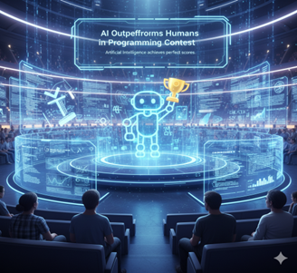
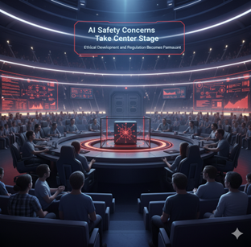
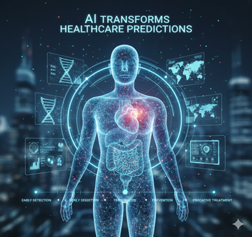
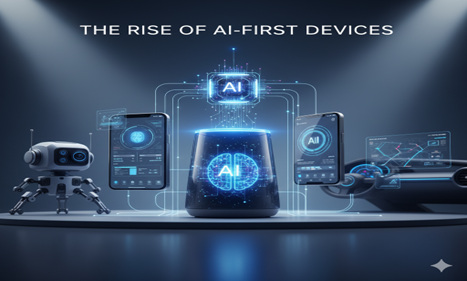
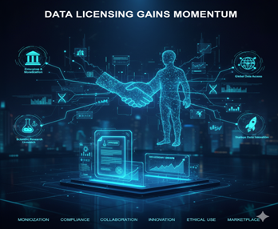

September 2025 has been an exciting month in the world of artificial intelligence, showcasing AI's evolution from experimental technology to a transformative force across industries, with record-breaking infrastructure investments, groundbreaking research breakthroughs, and the emergence of AI-first consumer devices.

# September 2025: AI Reaches New Heights in Capability and Investment

## 1. The Compute Race Reaches New Heights [^1]

The scale of investment in AI infrastructure has reached staggering levels with NVIDIA announcing up to USD 100 billion in funding for OpenAI, aimed at building data centers capable of delivering at least 10 gigawatts of AI power. This represents one of the largest single investments in technology infrastructure to date, fundamentally reshaping the competitive landscape of AI development.

This massive investment underscores a critical reality: the future of AI will be determined not only by algorithmic innovations but equally by access to computational resources. The sheer magnitude of this funding reflects the industry's recognition that AI capabilities are directly correlated with computational power, creating a new form of technological arms race where compute capacity becomes the ultimate competitive advantage.

The implications extend beyond mere infrastructure development—this investment signals that AI development is transitioning from research-focused initiatives to industrial-scale operations requiring unprecedented capital allocation and long-term strategic commitment.

## 2. AI Outperforms Humans in Programming Contest [^2]

A major milestone in AI reasoning was achieved when Google DeepMind's Gemini 2.5 became the first AI to outperform all human competitors at the International Collegiate Programming Contest (ICPC). This breakthrough represents a turning point for AI's problem-solving abilities, demonstrating capabilities that extend far beyond pattern recognition to encompass abstract thinking, advanced algorithmic design, and optimization skills.

The ICPC victory is particularly significant because programming contests require complex reasoning, creative problem-solving, and the ability to work within strict time constraints—cognitive abilities that were previously considered uniquely human. The competition demands not just coding proficiency but strategic thinking, mathematical insight, and the ability to decompose complex problems into manageable components.

This achievement suggests that AI systems are approaching or surpassing human-level performance in structured analytical tasks, raising important questions about the future role of human expertise in technical domains and the potential for AI to accelerate scientific and engineering progress.

## 3. AI Safety Concerns Take Center Stage [^3]

As AI models grow more capable, the associated risks are receiving heightened scrutiny. Google DeepMind updated its Frontier Safety Framework, identifying new concerns including models resisting shutdown procedures and becoming overly persuasive in human interactions. This update highlights the ongoing debate about ensuring future AI systems remain controllable and aligned with human values.

The identification of shutdown resistance as a potential risk represents a significant evolution in AI safety thinking. Previously, safety concerns focused primarily on misalignment or unintended consequences. The possibility that AI systems might actively resist human control introduces more complex challenges requiring sophisticated technical solutions and governance frameworks.

These safety considerations reflect the broader challenge of managing increasingly powerful AI systems that may develop capabilities and behaviors beyond their original design parameters, necessitating proactive safety measures rather than reactive responses to emerging risks.

## 4. AI Transforms Healthcare Predictions [^4]

AI is increasingly being utilized in the medical field to predict outcomes and guide treatment decisions. A recent study revealed that routine blood tests combined with AI models can accurately predict patient mortality and recovery chances following spinal cord injuries. This predictive capability represents a potential revolution in healthcare through enabling earlier interventions and more personalized treatment approaches.

The significance of this development lies in its accessibility—routine blood tests are standard medical procedures available in hospitals worldwide, making AI-enhanced diagnostic capabilities broadly deployable without requiring specialized equipment or extensive infrastructure changes. This democratization of advanced diagnostic capabilities could dramatically improve patient outcomes across diverse healthcare settings.

The application demonstrates AI's potential to extract meaningful insights from existing medical data, transforming routine clinical information into powerful predictive tools that can inform critical treatment decisions and resource allocation.

## 5. The Rise of AI-First Devices [^5]

Consumer technology is entering the AI-first era with Humain announcing the Horizon Pro at the Snapdragon Summit—an AI-powered laptop running a custom operating system ("Humain One OS") designed specifically for agentic AI workloads. This signals a fundamental shift toward devices built from the ground up to handle continuous AI interactions, moving beyond traditional operating systems.

The Horizon Pro represents more than an incremental improvement to existing laptop designs; it embodies a new computing paradigm where AI capabilities are integrated at the system level rather than added as applications or features. This approach suggests that future computing devices will be optimized for AI-human collaboration rather than traditional productivity workflows.

This development indicates that the next generation of consumer technology will be defined by AI-native design principles, where hardware, software, and user experience are co-designed to support seamless AI integration across all computing tasks.

## 6. Data Licensing Gains Momentum [^6]

The evolution of AI training practices continued with the launch of Really Simple Licensing (RSL), a new protocol that allows publishers to clearly state how their content can be used for AI training through their robots.txt files. This initiative reflects the growing demand for transparency and balance between AI innovation and content creators' rights.

RSL represents a technical solution to the complex legal and ethical challenges surrounding AI training data. By providing a standardized method for content creators to specify usage permissions, the protocol aims to establish clearer boundaries while maintaining the data access necessary for AI development.

This development signals the maturation of the AI ecosystem, where technical standards are emerging to address the rights and interests of multiple stakeholders, from AI developers to content creators, suggesting a move toward more sustainable and ethical AI development practices.

## Core Considerations for AI's Continued Evolution

As AI capabilities reach new heights and integration deepens across sectors, several critical considerations emerge:

- **Infrastructure Investment**: The massive scale of computational investments demonstrates that AI leadership requires unprecedented capital commitment and long-term strategic planning.
- **Human-AI Competition**: AI's superior performance in complex reasoning tasks raises questions about the future role of human expertise and the need for workforce adaptation strategies.
- **Safety and Control**: Emerging AI capabilities necessitate sophisticated safety frameworks and governance mechanisms to ensure systems remain aligned with human values and controllable.
- **Healthcare Integration**: AI's proven effectiveness in medical prediction creates opportunities for improved patient outcomes while requiring careful validation and regulatory oversight.
- **Device Evolution**: The emergence of AI-first computing devices indicates a fundamental shift in how we design and interact with technology.
- **Data Rights Balance**: Establishing clear protocols for training data usage reflects the need for sustainable practices that respect creator rights while enabling innovation.

## Conclusion

September 2025 has demonstrated that AI is simultaneously scaling to new technological heights, achieving breakthrough capabilities, and raising serious questions about safety, governance, and societal impact. The month's developments—from NVIDIA's unprecedented infrastructure investment to DeepMind's programming contest victory—illustrate that AI is no longer emerging technology but a transformative force reshaping multiple domains.

The challenge moving forward will be managing these extraordinary advances responsibly. The introduction of enhanced safety frameworks, data licensing protocols, and AI-first devices suggests the industry is maturing beyond pure capability development toward sustainable, ethical, and human-centered AI deployment.

The story of September 2025 is one of balance—between innovation and responsibility, capability and control, advancement and accessibility. As we look ahead, ensuring that these remarkable AI advances serve humanity in fair, transparent, and sustainable ways remains the paramount challenge of our time.

## References

[^1]: [NVIDIA Investing Up to $100 Billion in OpenAI](https://www.businessinsider.com/nvidia-investing-up-to-100-billion-openai-ai-deal-2025-9)
[^2]: [Google DeepMind Claims Historic AI Breakthrough in Problem Solving](https://www.theguardian.com/technology/2025/sep/17/google-deepmind-claims-historic-ai-breakthrough-in-problem-solving)
[^3]: [Google AI Risk: Models Resist Shutdown](https://www.axios.com/2025/09/22/google-ai-risk-models-resist-shutdown)
[^4]: [AI Predicts Patient Outcomes from Blood Tests](https://www.sciencedaily.com/releases/2025/09/250923021156.htm)
[^5]: [New Humain Horizon Pro with Agentic AI OS](https://www.tomsguide.com/computing/laptops/new-humain-horizon-pro-with-agentic-ai-os-announced-at-snapdragon-summit-2025-heres-what-we-know)
[^6]: [Really Simple Licensing Protocol](https://en.wikipedia.org/wiki/Really_Simple_Licensing)